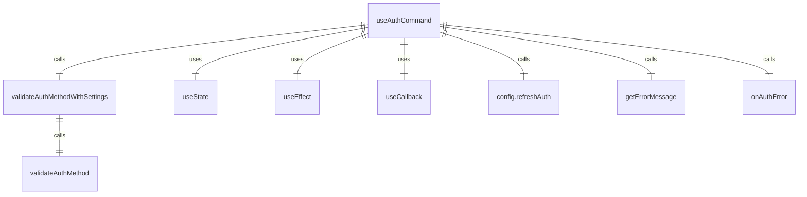

# useAuth.ts

这个文件提供了认证相关的 React 钩子和验证函数。

## 功能概述

1. 导出 `validateAuthMethodWithSettings` 验证函数
2. 导出 `useAuthCommand` React 钩子
3. 管理认证状态和错误处理

## 主要函数

### validateAuthMethodWithSettings
- 验证认证方法是否符合设置要求
- 检查强制认证类型
- 检查外部认证设置
- 调用 `validateAuthMethod` 进行基础验证

### useAuthCommand
- React 钩子，用于管理认证状态
- 使用 `useState` 管理认证状态和错误
- 使用 `useEffect` 处理认证逻辑
- 使用 `useCallback` 优化错误处理函数

## 依赖关系

- 依赖 React 的 `useState`、`useEffect` 和 `useCallback` 钩子
- 依赖 `../../config/settings.js` 中的 `LoadedSettings` 类型
- 依赖 `@google/gemini-cli-core` 中的 `AuthType` 枚举和 `Config` 类型
- 依赖 `@google/gemini-cli-core` 中的 `getErrorMessage` 函数
- 依赖 `../types.js` 中的 `AuthState` 枚举
- 依赖 `../../config/auth.js` 中的 `validateAuthMethod` 函数

## 认证状态管理

1. `AuthState.Unauthenticated`：未认证状态
2. `AuthState.Updating`：更新认证状态
3. `AuthState.Authenticated`：已认证状态

## 认证逻辑

1. 检查认证类型是否已选择
2. 验证认证方法是否有效
3. 检查默认认证类型环境变量
4. 调用 `config.refreshAuth` 刷新认证
5. 处理认证成功和失败情况

## 返回值

### useAuthCommand 返回值
- `authState`：当前认证状态
- `setAuthState`：设置认证状态的函数
- `authError`：认证错误信息
- `onAuthError`：处理认证错误的函数

## 函数级调用关系



## 变量级调用关系

```mermaid
erDiagram
    validateAuthMethodWithSettings {
        AuthType authType
        LoadedSettings settings
        string | undefined enforcedType
    }
    useAuthCommand {
        LoadedSettings settings
        Config config
        AuthState authState
        function setAuthState
        string | null authError
        function setAuthError
        function onAuthError
        AuthType | undefined authType
        string | undefined error
        string | undefined defaultAuthType
        unknown e
    }
```