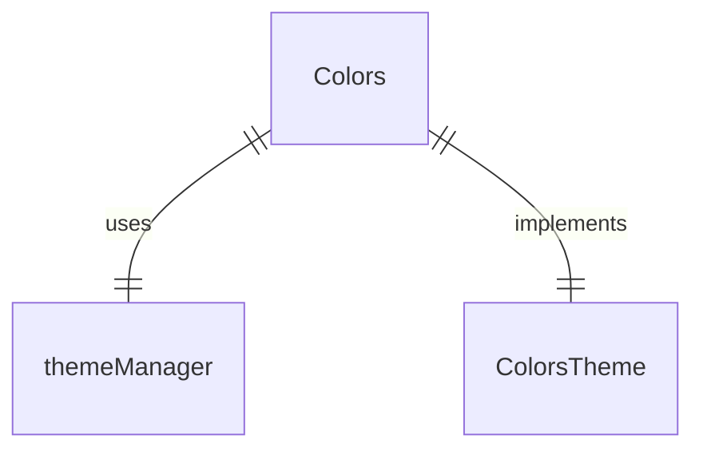
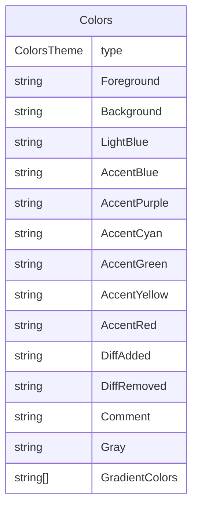

# colors.ts

这个文件导出了一个颜色主题对象，用于应用程序的 UI 颜色管理。

## 功能概述

1. 导出 `Colors` 对象作为颜色主题
2. 通过主题管理器获取活动主题的颜色
3. 提供一致的颜色访问接口

## 主要对象

### Colors
- 实现 `ColorsTheme` 接口
- 通过 `themeManager` 获取活动主题的颜色值
- 使用 getter 方法动态获取颜色值

## 依赖关系

- 依赖 `./themes/theme-manager.js` 中的 `themeManager`
- 依赖 `./themes/theme.js` 中的 `ColorsTheme` 类型

## 颜色属性

- `type`：主题类型
- `Foreground`：前景色
- `Background`：背景色
- `LightBlue`：浅蓝色
- `AccentBlue`：强调蓝色
- `AccentPurple`：强调紫色
- `AccentCyan`：强调青色
- `AccentGreen`：强调绿色
- `AccentYellow`：强调黄色
- `AccentRed`：强调红色
- `DiffAdded`：差异添加颜色
- `DiffRemoved`：差异删除颜色
- `Comment`：注释颜色
- `Gray`：灰色
- `GradientColors`：渐变色数组

## 函数级调用关系

## 变量级调用关系

