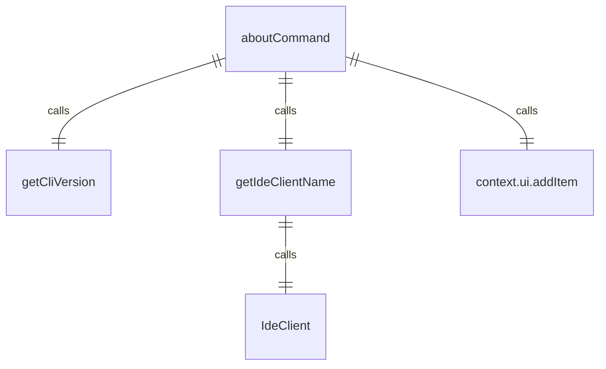
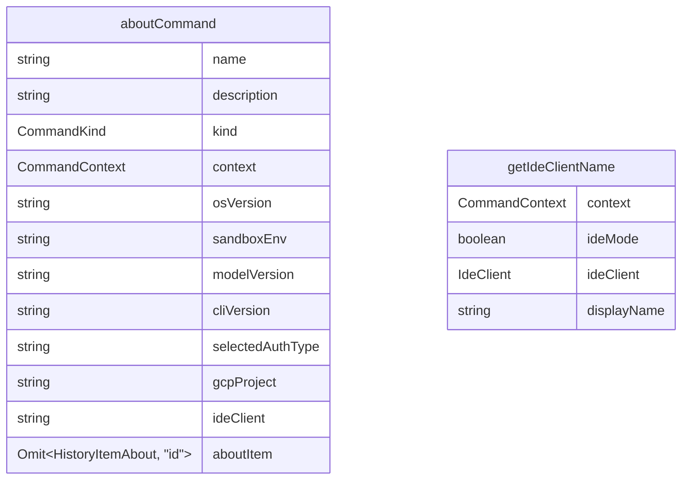

# aboutCommand.ts

这个文件定义了 `/about` 斜杠命令，用于显示版本信息。

## 功能概述

1. 导出 `aboutCommand` 斜杠命令对象
2. 显示 CLI 版本、操作系统、沙箱环境等信息
3. 获取 IDE 客户端信息

## 命令对象

### aboutCommand
- `name`：命令名称（'about'）
- `description`：命令描述（'show version info'）
- `kind`：命令类型（`CommandKind.BUILT_IN`）
- `action`：命令执行函数

## 依赖关系

- 依赖 `../../utils/version.js` 中的 `getCliVersion` 函数
- 依赖 `./types.js` 中的 `CommandContext` 和 `SlashCommand` 类型
- 依赖 `./types.js` 中的 `CommandKind` 枚举
- 依赖 Node.js 的 `process` 模块
- 依赖 `../types.js` 中的 `MessageType` 枚举和 `HistoryItemAbout` 类型
- 依赖 `@google/gemini-cli-core` 中的 `IdeClient`

## 命令功能

1. 获取操作系统版本
2. 获取沙箱环境信息
3. 获取模型版本
4. 获取 CLI 版本
5. 获取认证类型
6. 获取 GCP 项目信息
7. 获取 IDE 客户端名称
8. 将信息添加到 UI 历史记录中

## 辅助函数

### getIdeClientName
- 异步函数，获取 IDE 客户端名称
- 如果未启用 IDE 模式，返回空字符串
- 使用 `IdeClient.getInstance()` 获取 IDE 客户端实例
- 返回检测到的 IDE 显示名称

## 函数级调用关系

## 变量级调用关系

