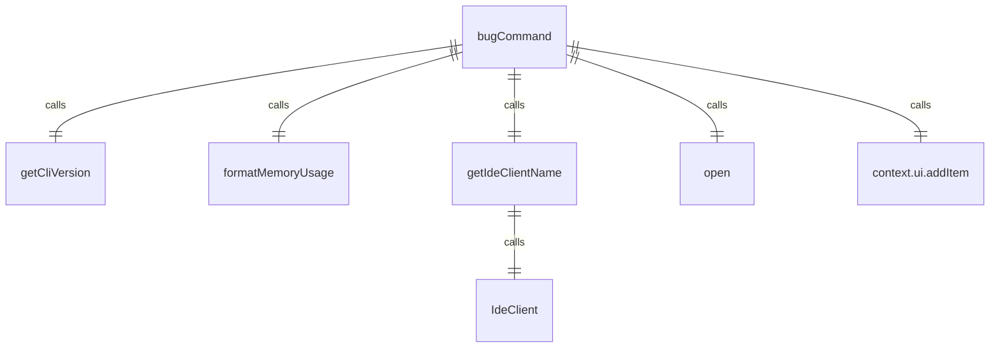

# bugCommand.ts

这个文件定义了 `/bug` 斜杠命令，用于提交错误报告。

## 功能概述

1. 导出 `bugCommand` 斜杠命令对象
2. 收集系统和应用程序信息
3. 生成错误报告 URL 并在浏览器中打开

## 命令对象

### bugCommand
- `name`：命令名称（'bug'）
- `description`：命令描述（'submit a bug report'）
- `kind`：命令类型（`CommandKind.BUILT_IN`）
- `action`：命令执行函数

## 依赖关系

- 依赖 `open` 包用于打开 URL
- 依赖 Node.js 的 `process` 模块
- 依赖 `./types.js` 中的类型定义
- 依赖 `../types.js` 中的 `MessageType` 枚举
- 依赖 `../../generated/git-commit.js` 中的 `GIT_COMMIT_INFO`
- 依赖 `../utils/formatters.js` 中的 `formatMemoryUsage` 函数
- 依赖 `../../utils/version.js` 中的 `getCliVersion` 函数
- 依赖 `@google/gemini-cli-core` 中的 `IdeClient` 和 `sessionId`

## 命令功能

1. 收集错误描述参数
2. 获取操作系统版本信息
3. 获取沙箱环境信息
4. 获取模型版本
5. 获取 CLI 版本
6. 获取内存使用情况
7. 获取 IDE 客户端名称
8. 构建包含系统信息的错误报告内容
9. 生成 GitHub 错误报告 URL
10. 在浏览器中打开错误报告页面
11. 在 UI 中显示错误报告 URL

## 辅助函数

### getIdeClientName
- 异步函数，获取 IDE 客户端名称
- 如果未启用 IDE 模式，返回空字符串
- 使用 `IdeClient.getInstance()` 获取 IDE 客户端实例
- 返回检测到的 IDE 显示名称

## 错误处理

- 捕获打开浏览器时的错误
- 在 UI 中显示错误信息

## 函数级调用关系



## 变量级调用关系

```mermaid
erDiagram
    bugCommand {
        string name
        string description
        CommandKind kind
        CommandContext context
        string | undefined args
        string bugDescription
        Config | undefined config
        string osVersion
        string sandboxEnv
        string modelVersion
        string cliVersion
        string memoryUsage
        string ideClient
        string info
        string bugReportUrl
        object bugCommandSettings
        string | undefined errorMessage
    }
    getIdeClientName {
        CommandContext context
        boolean ideMode
        IdeClient ideClient
        string displayName
    }
```