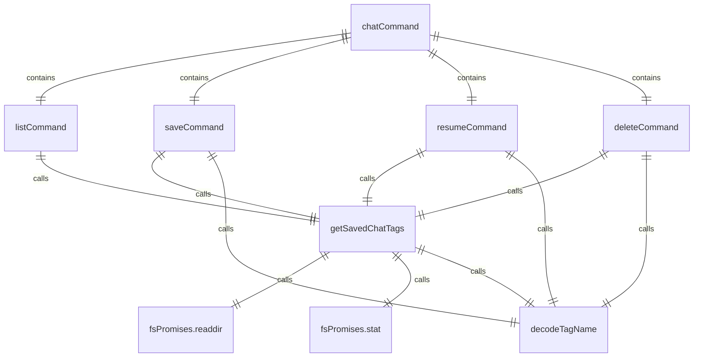

# chatCommand.ts

这个文件定义了 `/chat` 斜杠命令及其子命令，用于管理对话历史。

## 功能概述

1. 导出 `chatCommand` 斜杠命令对象
2. 提供列出、保存、恢复和删除对话历史的功能
3. 支持自动补全功能

## 命令对象

### chatCommand
- `name`：命令名称（'chat'）
- `description`：命令描述（'Manage conversation history.'）
- `kind`：命令类型（`CommandKind.BUILT_IN`）
- `subCommands`：子命令数组（[listCommand, saveCommand, resumeCommand, deleteCommand]）

## 子命令

### listCommand
- `name`：'list'
- `description`：'List saved conversation checkpoints'
- 列出保存的对话检查点

### saveCommand
- `name`：'save'
- `description`：'Save the current conversation as a checkpoint. Usage: /chat save <tag>'
- 保存当前对话为检查点

### resumeCommand
- `name`：'resume'
- `altNames`：['load']
- `description`：'Resume a conversation from a checkpoint. Usage: /chat resume <tag>'
- 从检查点恢复对话

### deleteCommand
- `name`：'delete'
- `description`：'Delete a conversation checkpoint. Usage: /chat delete <tag>'
- 删除对话检查点

## 辅助函数

### getSavedChatTags
- 异步函数，获取保存的聊天标签
- 读取检查点文件并解析标签信息
- 支持按修改时间排序

### ChatDetail
- 接口定义，包含聊天详情（名称和修改时间）

## 依赖关系

- 依赖 Node.js 的 `fs/promises` 模块
- 依赖 React 库
- 依赖 `ink` 中的 `Text` 组件
- 依赖 `../colors.js` 中的 `Colors` 对象
- 依赖 `./types.js` 中的类型定义
- 依赖 `@google/gemini-cli-core` 中的 `decodeTagName` 函数
- 依赖 Node.js 的 `path` 模块
- 依赖 `../types.js` 中的类型定义

## 功能详情

### listCommand
1. 获取保存的聊天标签
2. 格式化输出聊天列表
3. 显示每个检查点的保存时间

### saveCommand
1. 验证标签参数
2. 检查检查点是否已存在
3. 确认覆盖操作
4. 保存当前对话历史
5. 返回保存成功消息

### resumeCommand
1. 验证标签参数
2. 加载指定的检查点
3. 解析对话历史
4. 映射角色到消息类型
5. 返回加载的历史记录

### deleteCommand
1. 验证标签参数
2. 删除指定的检查点
3. 返回删除结果消息

## 自动补全

- `resumeCommand` 和 `deleteCommand` 支持自动补全
- 基于保存的聊天标签提供补全建议

## 函数级调用关系



## 变量级调用关系

```mermaid
erDiagram
    chatCommand {
        string name
        string description
        CommandKind kind
        SlashCommand[] subCommands
    }
    listCommand {
        string name
        string description
        CommandKind kind
        CommandContext context
        ChatDetail[] chatDetails
        number maxNameLength
        string message
        ChatDetail chat
        string paddedName
        string isoString
        RegExpMatchArray | null match
        string formattedDate
    }
    saveCommand {
        string name
        string description
        CommandKind kind
        CommandContext context
        string args
        string tag
        Logger logger
        Config config
        boolean exists
        Chat | undefined chat
        HistoryItem[] history
    }
    resumeCommand {
        string name
        string[] altNames
        string description
        CommandKind kind
        CommandContext context
        string args
        string tag
        Logger logger
        HistoryItem[] conversation
        object rolemap
        HistoryItemWithoutId[] uiHistory
        boolean hasSystemPrompt
        number i
        HistoryItem item
        string text
        MessageType type
    }
    deleteCommand {
        string name
        string description
        CommandKind kind
        CommandContext context
        string args
        string tag
        Logger logger
        boolean deleted
    }
    getSavedChatTags {
        CommandContext context
        boolean mtSortDesc
        Config | undefined cfg
        string | undefined geminiDir
        string file_head
        string file_tail
        string[] files
        Array~object~ chatDetails
        string file
        string filePath
        Stats stats
        string tagName
    }
    ChatDetail {
        string name
        Date mtime
    }
```