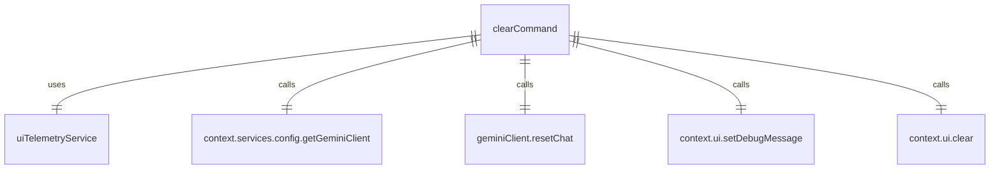

# clearCommand.ts

这个文件定义了 `/clear` 斜杠命令，用于清除屏幕和对话历史。

## 功能概述

1. 导出 `clearCommand` 斜杠命令对象
2. 提供清除终端屏幕和重置对话历史的功能

## 命令对象

### clearCommand
- `name`：命令名称（'clear'）
- `description`：命令描述（'clear the screen and conversation history'）
- `kind`：命令类型（`CommandKind.BUILT_IN`）
- `action`：命令执行函数

## 依赖关系

- 依赖 `@google/gemini-cli-core` 中的 `uiTelemetryService`
- 依赖 `./types.js` 中的 `SlashCommand` 类型
- 依赖 `./types.js` 中的 `CommandKind` 枚举

## 命令功能

1. 获取 Gemini 客户端实例
2. 如果存在 Gemini 客户端：
   - 设置调试消息"Clearing terminal and resetting chat."
   - 重置聊天历史
3. 如果不存在 Gemini 客户端：
   - 设置调试消息"Clearing terminal."
4. 重置最后提示令牌计数
5. 清除 UI 界面

## 错误处理

- 如果 `resetChat` 失败，异常会传播并停止命令执行，向用户发出失败信号

## 函数级调用关系



## 变量级调用关系

```mermaid
erDiagram
    clearCommand {
        string name
        string description
        CommandKind kind
        CommandContext context
        string _args
        GeminiClient | undefined geminiClient
    }
```