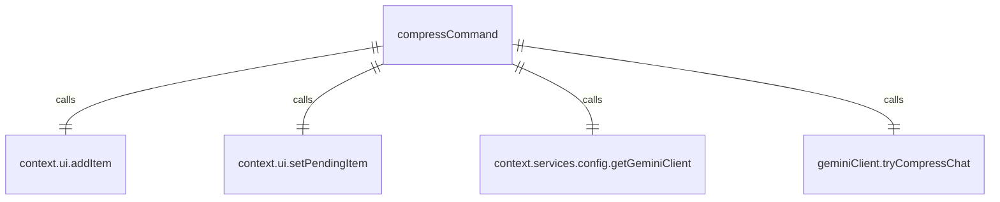

# compressCommand.ts

这个文件定义了 `/compress` 斜杠命令，用于压缩上下文。

## 功能概述

1. 导出 `compressCommand` 斜杠命令对象
2. 提供压缩对话历史上下文的功能
3. 支持别名 `/summarize`

## 命令对象

### compressCommand
- `name`：命令名称（'compress'）
- `altNames`：别名数组（['summarize']）
- `description`：命令描述（'Compresses the context by replacing it with a summary.'）
- `kind`：命令类型（`CommandKind.BUILT_IN`）
- `action`：命令执行函数

## 依赖关系

- 依赖 `../types.js` 中的 `HistoryItemCompression` 类型和 `MessageType` 枚举
- 依赖 `./types.js` 中的 `SlashCommand` 类型
- 依赖 `./types.js` 中的 `CommandKind` 枚举

## 命令功能

1. 检查是否有正在进行的压缩操作
2. 创建待处理的压缩消息
3. 设置待处理项
4. 调用 Gemini 客户端的 `tryCompressChat` 方法
5. 根据压缩结果添加成功或失败消息
6. 清除待处理项

## 错误处理

- 捕获压缩过程中的异常
- 显示错误信息
- 确保待处理项被清除

## 函数级调用关系



## 变量级调用关系

```mermaid
erDiagram
    compressCommand {
        string name
        string[] altNames
        string description
        CommandKind kind
        CommandContext context
        UIState ui
        boolean pendingItem
        HistoryItemCompression pendingMessage
        string promptId
        CompressionResult | undefined compressed
        unknown e
    }
```