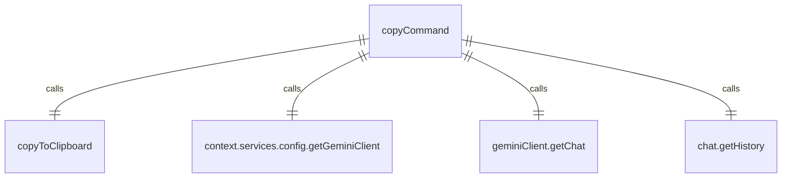

# copyCommand.ts

这个文件定义了 `/copy` 斜杠命令，用于将最后的结果或代码片段复制到剪贴板。

## 功能概述

1. 导出 `copyCommand` 斜杠命令对象
2. 提供复制最后 AI 输出到剪贴板的功能

## 命令对象

### copyCommand
- `name`：命令名称（'copy'）
- `description`：命令描述（'Copy the last result or code snippet to clipboard'）
- `kind`：命令类型（`CommandKind.BUILT_IN`）
- `action`：命令执行函数

## 依赖关系

- 依赖 `../utils/commandUtils.js` 中的 `copyToClipboard` 函数
- 依赖 `./types.js` 中的 `SlashCommand` 和 `SlashCommandActionReturn` 类型
- 依赖 `./types.js` 中的 `CommandKind` 枚举

## 命令功能

1. 获取 Gemini 客户端和对话历史
2. 查找最后一条 AI（模型角色）消息
3. 提取消息中的文本内容
4. 将文本内容复制到剪贴板
5. 返回操作结果消息

## 错误处理

- 捕获复制到剪贴板时的异常
- 显示错误信息
- 处理无输出或无文本内容的情况

## 函数级调用关系



## 变量级调用关系

```mermaid
erDiagram
    copyCommand {
        string name
        string description
        CommandKind kind
        CommandContext context
        string _args
        Chat | undefined chat
        HistoryItem[] | undefined history
        HistoryItem | undefined lastAiMessage
        string | undefined lastAiOutput
        unknown error
        string message
    }
```