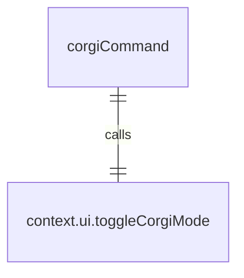
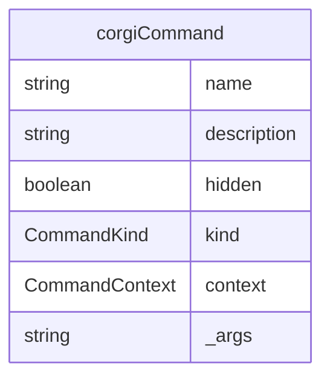

# corgiCommand.ts

这个文件定义了 `/corgi` 斜杠命令，用于切换柯基模式。

## 功能概述

1. 导出 `corgiCommand` 斜杠命令对象
2. 提供切换柯基模式的功能
3. 命令被隐藏（不显示在帮助列表中）

## 命令对象

### corgiCommand
- `name`：命令名称（'corgi'）
- `description`：命令描述（'Toggles corgi mode.'）
- `hidden`：隐藏标志（true）
- `kind`：命令类型（`CommandKind.BUILT_IN`）
- `action`：命令执行函数

## 依赖关系

- 依赖 `./types.js` 中的 `CommandKind` 枚举和 `SlashCommand` 类型

## 命令功能

1. 调用 `context.ui.toggleCorgiMode()` 切换柯基模式

## 函数级调用关系

## 变量级调用关系

