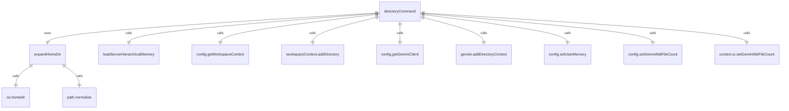

# directoryCommand.tsx

这个文件定义了 `/directory` 斜杠命令及其子命令，用于管理工作区目录。

## 功能概述

1. 导出 `directoryCommand` 斜杠命令对象
2. 提供添加和显示工作区目录的功能
3. 支持路径展开和错误处理

## 命令对象

### directoryCommand
- `name`：命令名称（'directory'）
- `altNames`：别名数组（['dir']）
- `description`：命令描述（'Manage workspace directories'）
- `kind`：命令类型（`CommandKind.BUILT_IN`）
- `subCommands`：子命令数组（包含 add 和 show 命令）

## 子命令

### add 命令
- `name`：'add'
- `description`：'Add directories to the workspace. Use comma to separate multiple paths'
- 添加目录到工作区
- 支持多个路径（逗号分隔）
- 展开用户主目录路径
- 刷新内存内容
- 更新 Gemini 客户端上下文

### show 命令
- `name`：'show'
- `description`：'Show all directories in the workspace'
- 显示当前工作区中的所有目录

## 辅助函数

### expandHomeDir
- 展开路径中的用户主目录引用
- 支持 `~`、`~/` 和 `%USERPROFILE%` 格式
- 返回标准化的路径

## 依赖关系

- 依赖 `./types.js` 中的类型定义
- 依赖 `../types.js` 中的 `MessageType` 枚举
- 依赖 Node.js 的 `os` 和 `path` 模块
- 依赖 `@google/gemini-cli-core` 中的 `loadServerHierarchicalMemory` 函数

## 功能详情

### add 命令功能
1. 解析参数中的路径列表
2. 验证配置可用性
3. 检查沙箱限制
4. 展开路径中的主目录引用
5. 添加目录到工作区上下文
6. 刷新内存内容（如果需要）
7. 更新 Gemini 客户端上下文
8. 显示操作结果和错误信息

### show 命令功能
1. 验证配置可用性
2. 获取工作区上下文中的目录列表
3. 格式化目录列表
4. 显示当前工作区目录

## 错误处理

- 处理配置不可用的情况
- 处理沙箱限制
- 捕获路径添加过程中的异常
- 捕获内存刷新过程中的异常
- 显示详细的错误信息

## 函数级调用关系



## 变量级调用关系

```mermaid
erDiagram
    directoryCommand {
        string name
        string[] altNames
        string description
        CommandKind kind
        SlashCommand[] subCommands
    }
    addCommand {
        string name
        string description
        CommandKind kind
        CommandContext context
        string args
        Config | undefined config
        WorkspaceContext workspaceContext
        string[] rest
        string[] pathsToAdd
        boolean restrictiveSandbox
        string[] added
        string[] errors
        string pathToAdd
        unknown e
        string error
        boolean shouldLoadMemory
        object memoryResult
        string memoryContent
        number fileCount
        GeminiClient | undefined gemini
    }
    showCommand {
        string name
        string description
        CommandKind kind
        CommandContext context
        Config | undefined config
        WorkspaceContext workspaceContext
        string[] directories
        string directoryList
    }
    expandHomeDir {
        string p
        string expandedPath
    }
```