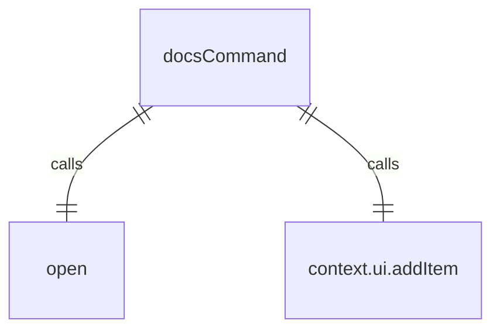

# docsCommand.ts

这个文件定义了 `/docs` 斜杠命令，用于在浏览器中打开完整的 Gemini CLI 文档。

## 功能概述

1. 导出 `docsCommand` 斜杠命令对象
2. 提供在浏览器中打开文档的功能
3. 在沙箱环境中显示文档 URL

## 命令对象

### docsCommand
- `name`：命令名称（'docs'）
- `description`：命令描述（'open full Gemini CLI documentation in your browser'）
- `kind`：命令类型（`CommandKind.BUILT_IN`）
- `action`：命令执行函数

## 依赖关系

- 依赖 `open` 包用于打开 URL
- 依赖 Node.js 的 `process` 模块
- 依赖 `./types.js` 中的类型定义
- 依赖 `../types.js` 中的 `MessageType` 枚举

## 命令功能

1. 定义文档 URL（'https://goo.gle/gemini-cli-docs'）
2. 检查是否在沙箱环境中运行
3. 在沙箱环境中显示文档 URL 供用户手动打开
4. 在非沙箱环境中直接打开浏览器访问文档

## 函数级调用关系



## 变量级调用关系

```mermaid
erDiagram
    docsCommand {
        string name
        string description
        CommandKind kind
        CommandContext context
        string docsUrl
        string | undefined SANDBOX
    }
```