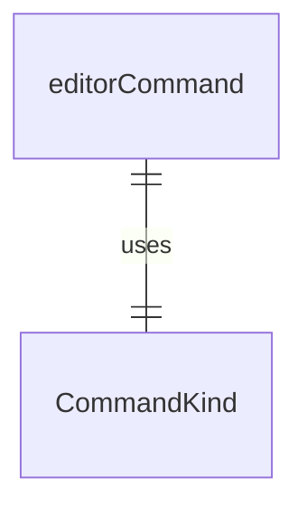
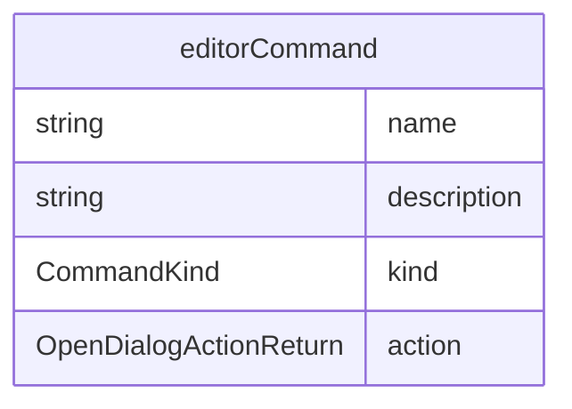

# editorCommand.ts

这个文件定义了 `/editor` 斜杠命令，用于设置外部编辑器偏好。

## 功能概述

1. 导出 `editorCommand` 斜杠命令对象
2. 提供打开编辑器设置对话框的功能

## 命令对象

### editorCommand
- `name`：命令名称（'editor'）
- `description`：命令描述（'set external editor preference'）
- `kind`：命令类型（`CommandKind.BUILT_IN`）
- `action`：命令执行函数，返回打开对话框的操作

## 依赖关系

- 依赖 `./types.js` 中的类型定义

## 命令功能

1. 打开编辑器设置对话框
2. 允许用户设置外部编辑器偏好

## 函数级调用关系

## 变量级调用关系

