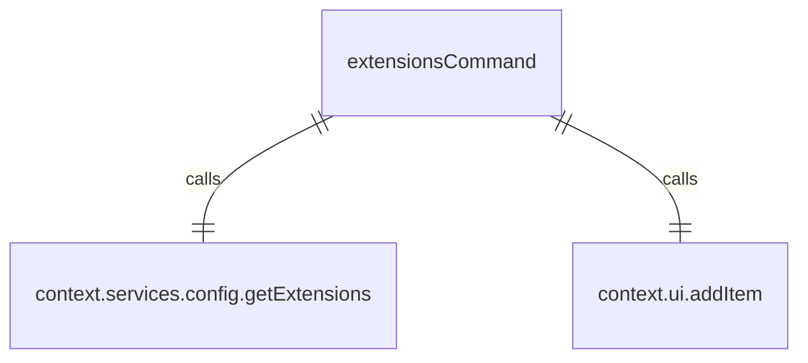

# extensionsCommand.ts

这个文件定义了 `/extensions` 斜杠命令，用于列出活动的扩展。

## 功能概述

1. 导出 `extensionsCommand` 斜杠命令对象
2. 提供列出活动扩展的功能

## 命令对象

### extensionsCommand
- `name`：命令名称（'extensions'）
- `description`：命令描述（'list active extensions'）
- `kind`：命令类型（`CommandKind.BUILT_IN`）
- `action`：命令执行函数

## 依赖关系

- 依赖 `./types.js` 中的类型定义
- 依赖 `../types.js` 中的 `MessageType` 枚举

## 命令功能

1. 获取配置中的扩展列表
2. 过滤出活动的扩展
3. 如果没有活动扩展，显示相应信息
4. 格式化扩展列表信息
5. 在 UI 中显示活动扩展列表

## 函数级调用关系



## 变量级调用关系

```mermaid
erDiagram
    extensionsCommand {
        string name
        string description
        CommandKind kind
        CommandContext context
        Extension[] | undefined activeExtensions
        string[] extensionLines
        string message
        Extension ext
    }
```