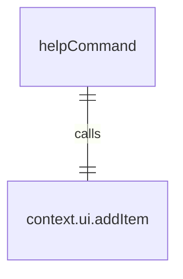
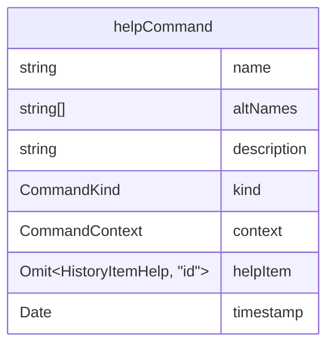

# helpCommand.ts

这个文件定义了 `/help` 斜杠命令，用于显示帮助信息。

## 功能概述

1. 导出 `helpCommand` 斜杠命令对象
2. 提供显示帮助信息的功能
3. 支持别名 `/?`

## 命令对象

### helpCommand
- `name`：命令名称（'help'）
- `altNames`：别名数组（['?']）
- `description`：命令描述（'for help on gemini-cli'）
- `kind`：命令类型（`CommandKind.BUILT_IN`）
- `action`：命令执行函数

## 依赖关系

- 依赖 `./types.js` 中的 `SlashCommand` 类型和 `CommandKind` 枚举
- 依赖 `../types.js` 中的 `MessageType` 枚举和 `HistoryItemHelp` 类型

## 命令功能

1. 创建帮助历史记录项
2. 设置时间戳
3. 将帮助项添加到 UI 历史记录中

## 函数级调用关系

## 变量级调用关系

