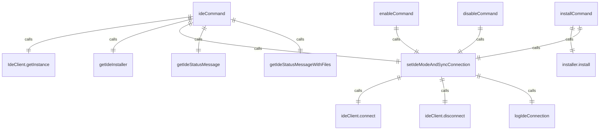

# ideCommand.ts

这个文件定义了 `/ide` 斜杠命令及其子命令，用于管理 IDE 集成。

## 功能概述

1. 导出 `ideCommand` 异步函数，返回斜杠命令对象
2. 提供检查状态、安装、启用和禁用 IDE 集成的功能
3. 根据连接状态动态调整可用子命令

## 命令对象

### ideCommand
- `name`：命令名称（'ide'）
- `description`：命令描述（'manage IDE integration'）
- `kind`：命令类型（`CommandKind.BUILT_IN`）
- `subCommands`：子命令数组（根据连接状态动态设置）

## 子命令

### statusCommand
- `name`：'status'
- `description`：'check status of IDE integration'
- 检查 IDE 集成状态并显示打开的文件列表

### installCommand
- `name`：'install'
- `description`：'install required IDE companion'
- 安装所需的 IDE 伴侣扩展

### enableCommand
- `name`：'enable'
- `description`：'enable IDE integration'
- 启用 IDE 集成

### disableCommand
- `name`：'disable'
- `description`：'disable IDE integration'
- 禁用 IDE 集成

## 辅助函数

### getIdeStatusMessage
- 获取 IDE 连接状态消息
- 返回信息或错误类型及内容

### formatFileList
- 格式化打开的文件列表
- 处理重复文件名的情况

### getIdeStatusMessageWithFiles
- 获取包含文件列表的 IDE 状态消息
- 异步函数

### setIdeModeAndSyncConnection
- 设置 IDE 模式并同步连接状态
- 异步函数

## 依赖关系

- 依赖 `@google/gemini-cli-core` 中的多个类型和函数
- 依赖 Node.js 的 `path` 模块
- 依赖 `./types.js` 中的类型定义
- 依赖 `../../config/settings.js` 中的 `SettingScope` 枚举

## 功能详情

### ideCommand 函数
1. 获取 IDE 客户端实例
2. 检查当前 IDE 环境是否支持
3. 如果不支持，返回错误消息
4. 如果支持，创建 IDE 命令对象和子命令
5. 根据连接状态设置可用的子命令

### installCommand 功能
1. 获取 IDE 安装器
2. 如果没有安装器，提示手动安装
3. 执行安装过程
4. 安装成功后启用 IDE 集成
5. 轮询检查连接状态

### enableCommand 功能
1. 设置用户设置中的 IDE 启用状态
2. 启用 IDE 模式并连接
3. 显示连接状态

### disableCommand 功能
1. 设置用户设置中的 IDE 禁用状态
2. 禁用 IDE 模式并断开连接
3. 显示连接状态

### statusCommand 功能
1. 获取 IDE 连接状态
2. 显示连接状态和打开的文件列表

## 错误处理

- 处理不支持的 IDE 环境
- 处理安装失败情况
- 处理连接失败情况
- 显示详细的错误信息

## 函数级调用关系



## 变量级调用关系

```mermaid
erDiagram
    ideCommand {
        IdeClient ideClient
        DetectedIde | null currentIDE
        string | undefined displayName
        SlashCommand ideSlashCommand
        SlashCommand statusCommand
        SlashCommand installCommand
        SlashCommand enableCommand
        SlashCommand disableCommand
        IDEConnectionStatus status
        boolean isConnected
    }
    getIdeStatusMessage {
        IdeClient ideClient
        IDEConnectionStatus connection
        string content
    }
    formatFileList {
        File[] openFiles
        Map~string,number~ basenameCounts
        string fileList
        string infoMessage
        File file
        string basename
        boolean isDuplicate
        string parentDir
        string displayName
    }
    getIdeStatusMessageWithFiles {
        IdeClient ideClient
        IDEConnectionStatus connection
        string content
        IdeContext | undefined context
        File[] | undefined openFiles
    }
    setIdeModeAndSyncConnection {
        Config config
        boolean value
        IdeClient ideClient
        IDEConnectionStatus status
    }
    statusCommand {
        IdeClient ideClient
        object statusMessage
        "info" | "error" messageType
        string content
    }
    installCommand {
        CommandContext context
        DetectedIde | null currentIDE
        IDEInstaller | undefined installer
        InstallResult result
        boolean success
        string message
        number i
        IDEConnectionStatus status
        object statusMessage
        "info" | "error" messageType
        string content
    }
    enableCommand {
        CommandContext context
        Config config
        IdeClient ideClient
        object statusMessage
        "info" | "error" messageType
        string content
    }
    disableCommand {
        CommandContext context
        Config config
        IdeClient ideClient
        object statusMessage
        "info" | "error" messageType
        string content
    }
```