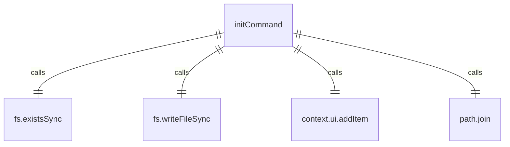

# initCommand.ts

这个文件定义了 `/init` 斜杠命令，用于分析项目并创建定制的 GEMINI.md 文件。

## 功能概述

1. 导出 `initCommand` 斜杠命令对象
2. 提供分析项目并创建 GEMINI.md 文件的功能

## 命令对象

### initCommand
- `name`：命令名称（'init'）
- `description`：命令描述（'Analyzes the project and creates a tailored GEMINI.md file.'）
- `kind`：命令类型（`CommandKind.BUILT_IN`）
- `action`：命令执行函数

## 依赖关系

- 依赖 Node.js 的 `fs` 和 `path` 模块
- 依赖 `./types.js` 中的类型定义
- 依赖 `./types.js` 中的 `CommandKind` 枚举

## 命令功能

1. 检查配置是否可用
2. 获取目标目录路径
3. 检查 GEMINI.md 文件是否已存在
4. 如果文件不存在，创建空的 GEMINI.md 文件
5. 提交提示给 AI 模型，要求分析项目并生成 GEMINI.md 内容

## 提示内容

提示 AI 模型执行以下任务：
1. 初始探索：列出文件和目录，读取 README 文件
2. 迭代深入：选择重要文件进行阅读
3. 识别项目类型：代码项目或非代码项目
4. 生成 GEMINI.md 内容：
   - 对于代码项目：项目概述、构建和运行、开发约定
   - 对于非代码项目：目录概述、关键文件、使用方法

## 错误处理

- 处理配置不可用的情况
- 处理 GEMINI.md 文件已存在的情况

## 函数级调用关系



## 变量级调用关系

```mermaid
erDiagram
    initCommand {
        string name
        string description
        CommandKind kind
        CommandContext context
        string _args
        Config | undefined config
        string targetDir
        string geminiMdPath
        boolean exists
    }
```