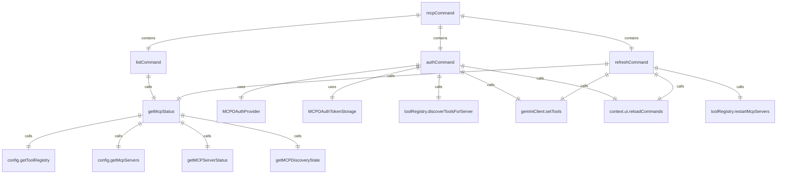

# mcpCommand.ts

这个文件定义了 `/mcp` 斜杠命令及其子命令，用于管理 Model Context Protocol (MCP) 服务器。

## 功能概述

1. 导出 `mcpCommand` 斜杠命令对象
2. 提供列出、认证和刷新 MCP 服务器的功能
3. 支持显示服务器和工具的详细信息

## 命令对象

### mcpCommand
- `name`：命令名称（'mcp'）
- `description`：命令描述（'list configured MCP servers and tools, or authenticate with OAuth-enabled servers'）
- `kind`：命令类型（`CommandKind.BUILT_IN`）
- `subCommands`：子命令数组（[listCommand, authCommand, refreshCommand]）
- `action`：默认操作函数，执行 listCommand

## 子命令

### listCommand
- `name`：'list'
- `description`：'List configured MCP servers and tools'
- 列出配置的 MCP 服务器和工具
- 支持参数控制显示详细信息

### authCommand
- `name`：'auth'
- `description`：'Authenticate with an OAuth-enabled MCP server'
- 对支持 OAuth 的 MCP 服务器进行认证
- 支持自动补全服务器名称

### refreshCommand
- `name`：'refresh'
- `description`：'Restarts MCP servers.'
- 重启 MCP 服务器

## 辅助函数

### getMcpStatus
- 异步函数，获取 MCP 服务器状态信息
- 支持显示描述和模式信息
- 格式化服务器和工具列表

## 常量定义

- `COLOR_GREEN`：绿色 ANSI 代码
- `COLOR_YELLOW`：黄色 ANSI 代码
- `COLOR_RED`：红色 ANSI 代码
- `COLOR_CYAN`：青色 ANSI 代码
- `COLOR_GREY`：灰色 ANSI 代码
- `RESET_COLOR`：重置颜色 ANSI 代码

## 依赖关系

- 依赖 `./types.js` 中的类型定义
- 依赖 `@google/gemini-cli-core` 中的多个类型和函数

## 功能详情

### listCommand 功能
1. 解析参数控制显示选项
2. 调用 `getMcpStatus` 获取状态信息
3. 支持显示描述、模式和提示信息

### authCommand 功能
1. 验证服务器名称参数
2. 检查服务器是否存在
3. 执行 OAuth 认证流程
4. 重新发现工具
5. 更新 Gemini 客户端工具
6. 重新加载斜杠命令

### refreshCommand 功能
1. 重启 MCP 服务器
2. 重新发现工具
3. 更新 Gemini 客户端工具
4. 重新加载斜杠命令
5. 显示更新后的状态

### getMcpStatus 功能
1. 获取配置和工具注册表
2. 检查 MCP 服务器配置
3. 获取服务器状态和工具列表
4. 格式化服务器和工具信息
5. 显示 OAuth 认证状态
6. 显示提示信息

## 错误处理

- 处理配置不可用的情况
- 处理工具注册表不可用的情况
- 处理服务器未找到的情况
- 处理认证失败的情况

## 自动补全

- `authCommand` 支持服务器名称自动补全

## 函数级调用关系



## 变量级调用关系

```mermaid
erDiagram
    mcpCommand {
        string name
        string description
        CommandKind kind
        SlashCommand[] subCommands
        CommandContext context
        string args
    }
    listCommand {
        string name
        string description
        CommandKind kind
        CommandContext context
        string args
        string[] lowerCaseArgs
        boolean hasDesc
        boolean hasNodesc
        boolean showSchema
        boolean showDescriptions
        boolean showTips
    }
    authCommand {
        string name
        string description
        CommandKind kind
        CommandContext context
        string args
        string serverName
        Config | undefined config
        object mcpServers
        object | undefined server
        object oauthConfig
        string | undefined mcpServerUrl
        MCPOAuthProvider authProvider
        MCPOAuthTokenStorage tokenStorage
        ToolRegistry | undefined toolRegistry
        GeminiClient | undefined geminiClient
        unknown error
        string errorMessage
    }
    refreshCommand {
        string name
        string description
        CommandKind kind
        CommandContext context
        Config | undefined config
        ToolRegistry | undefined toolRegistry
        GeminiClient | undefined geminiClient
    }
    getMcpStatus {
        CommandContext context
        boolean showDescriptions
        boolean showSchema
        boolean showTips
        Config | undefined config
        ToolRegistry | undefined toolRegistry
        object mcpServers
        string[] serverNames
        string[] blockedMcpServers
        string[] connectingServers
        MCPDiscoveryState discoveryState
        string message
        Tool[] allTools
        string serverName
        DiscoveredMCPTool[] serverTools
        DiscoveredMCPPrompt[] serverPrompts
        MCPServerStatus originalStatus
        boolean hasCachedItems
        MCPServerStatus status
        string statusIndicator
        string statusText
        object server
        string serverDisplayName
        boolean needsAuthHint
        object | undefined tokenStorage
        object | undefined hasToken
        boolean isExpired
        string[] parts
        string | undefined descLines
        string descLine
        object | undefined parameters
        string[] paramsLines
        string paramsLine
        DiscoveredMCPPrompt prompt
        string | undefined promptDescLines
        string promptDescLine
    }
```