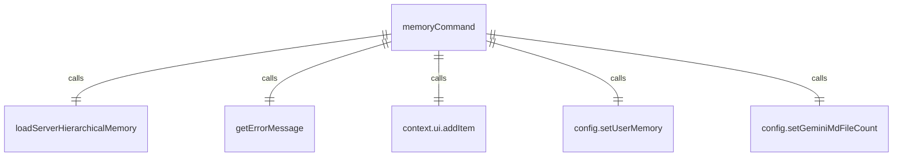

# memoryCommand.ts

这个文件定义了 `/memory` 斜杠命令及其子命令，用于与内存交互。

## 功能概述

1. 导出 `memoryCommand` 斜杠命令对象
2. 提供显示、添加和刷新内存的功能

## 命令对象

### memoryCommand
- `name`：命令名称（'memory'）
- `description`：命令描述（'Commands for interacting with memory.'）
- `kind`：命令类型（`CommandKind.BUILT_IN`）
- `subCommands`：子命令数组（包含 show、add 和 refresh 命令）

## 子命令

### show 命令
- `name`：'show'
- `description`：'Show the current memory contents.'
- 显示当前内存内容

### add 命令
- `name`：'add'
- `description`：'Add content to the memory.'
- 添加内容到内存

### refresh 命令
- `name`：'refresh'
- `description`：'Refresh the memory from the source.'
- 从源刷新内存

## 依赖关系

- 依赖 `@google/gemini-cli-core` 中的 `getErrorMessage` 和 `loadServerHierarchicalMemory` 函数
- 依赖 `../types.js` 中的 `MessageType` 枚举
- 依赖 `./types.js` 中的类型定义

## 功能详情

### show 命令功能
1. 获取配置中的用户内存内容
2. 获取内存文件数量
3. 格式化内存内容显示
4. 如果内存为空，显示相应信息

### add 命令功能
1. 验证参数是否为空
2. 显示尝试保存到内存的消息
3. 返回调用 `save_memory` 工具的操作

### refresh 命令功能
1. 显示刷新内存的消息
2. 调用 `loadServerHierarchicalMemory` 加载内存
3. 更新配置中的内存内容和文件数量
4. 显示刷新结果消息
5. 处理刷新过程中的错误

## 错误处理

- 处理 add 命令参数为空的情况
- 处理 refresh 命令加载内存时的异常
- 显示详细的错误信息

## 函数级调用关系



## 变量级调用关系

```mermaid
erDiagram
    memoryCommand {
        string name
        string description
        CommandKind kind
        SlashCommand[] subCommands
    }
    showCommand {
        string name
        string description
        CommandKind kind
        CommandContext context
        string memoryContent
        number fileCount
        string messageContent
    }
    addCommand {
        string name
        string description
        CommandKind kind
        CommandContext context
        string args
        string trimmedArgs
    }
    refreshCommand {
        string name
        string description
        CommandKind kind
        CommandContext context
        Config | undefined config
        object memoryResult
        string memoryContent
        number fileCount
        string successMessage
        unknown error
        string errorMessage
    }
```