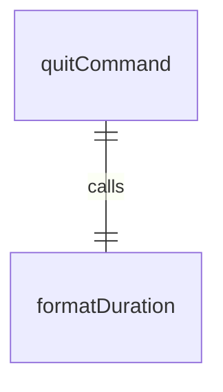
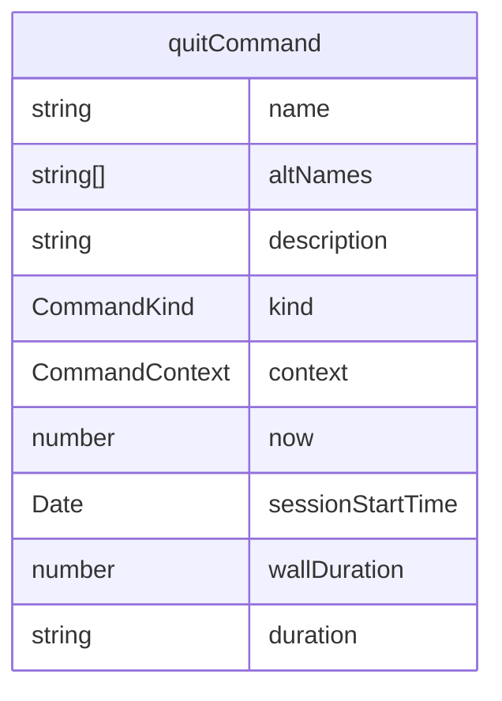

# quitCommand.ts

这个文件定义了 `/quit` 斜杠命令，用于退出 CLI。

## 功能概述

1. 导出 `quitCommand` 斜杠命令对象
2. 提供退出 CLI 的功能
3. 支持别名 `/exit`

## 命令对象

### quitCommand
- `name`：命令名称（'quit'）
- `altNames`：别名数组（['exit']）
- `description`：命令描述（'exit the cli'）
- `kind`：命令类型（`CommandKind.BUILT_IN`）
- `action`：命令执行函数

## 依赖关系

- 依赖 `../utils/formatters.js` 中的 `formatDuration` 函数
- 依赖 `./types.js` 中的 `CommandKind` 枚举和 `SlashCommand` 类型

## 命令功能

1. 计算会话持续时间
2. 格式化持续时间
3. 返回退出操作和相关消息

## 函数级调用关系

## 变量级调用关系

