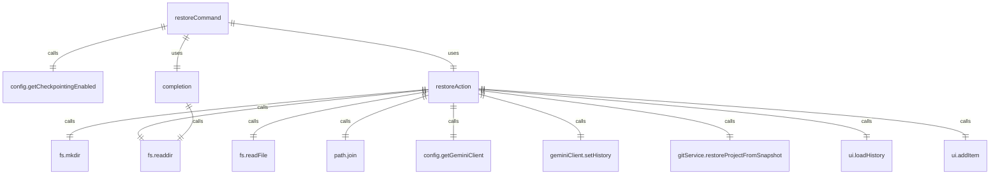

# restoreCommand.ts

这个文件定义了 `/restore` 斜杠命令，用于恢复工具调用。

## 功能概述

1. 导出 `restoreCommand` 函数，根据配置返回斜杠命令对象或 null
2. 提供列出和恢复可恢复工具调用的功能
3. 仅在启用检查点功能时可用

## 命令对象

### restoreCommand
- `name`：命令名称（'restore'）
- `description`：命令描述（'Restore a tool call. This will reset the conversation and file history to the state it was in when the tool call was suggested'）
- `kind`：命令类型（`CommandKind.BUILT_IN`）
- `action`：命令执行函数（`restoreAction`）
- `completion`：自动补全函数（`completion`）

## 辅助函数

### restoreAction
- 异步函数，执行恢复操作
- 列出可恢复的工具调用
- 恢复指定的工具调用
- 恢复历史记录和文件状态

### completion
- 异步函数，提供自动补全功能
- 返回可用的检查点文件列表

## 依赖关系

- 依赖 Node.js 的 `fs/promises` 和 `path` 模块
- 依赖 `./types.js` 中的类型定义
- 依赖 `@google/gemini-cli-core` 中的 `Config` 类型

## 功能详情

### restoreCommand 函数
1. 检查配置中的检查点功能是否启用
2. 如果未启用，返回 null
3. 如果启用，返回斜杠命令对象

### restoreAction 功能
1. 获取检查点目录路径
2. 确保目录存在
3. 读取目录中的 JSON 文件
4. 如果没有参数，列出可用的工具调用
5. 如果有参数，验证文件是否存在
6. 读取选定的文件
7. 恢复历史记录
8. 恢复客户端历史
9. 恢复 Git 项目状态
10. 返回工具调用操作

### completion 功能
1. 获取检查点目录路径
2. 读取目录中的文件
3. 过滤 JSON 文件
4. 返回不带扩展名的文件名列表

## 错误处理

- 处理检查点目录路径不可用的情况
- 处理目录读取失败的情况
- 处理文件不存在的情况
- 处理文件读取和解析失败的情况
- 处理 loadHistory 函数不可用的情况

## 函数级调用关系



## 变量级调用关系

```mermaid
erDiagram
    restoreCommand {
        Config | null config
        boolean checkpointingEnabled
        SlashCommand | null command
    }
    restoreAction {
        CommandContext context
        string args
        object services
        Config | undefined config
        GitService | undefined gitService
        object ui
        function addItem
        function loadHistory
        string | undefined checkpointDir
        string[] files
        string[] jsonFiles
        string selectedFile
        string filePath
        string data
        object toolCallData
        HistoryItem[] | undefined history
        HistoryItem[] | undefined clientHistory
        string | undefined commitHash
        unknown error
    }
    completion {
        CommandContext context
        string _partialArg
        object services
        Config | undefined config
        string | undefined checkpointDir
        string[] files
        string[] jsonFiles
    }
```