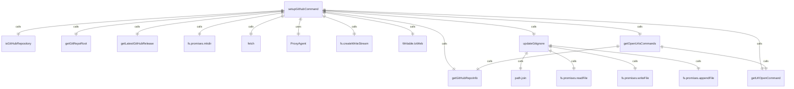

# setupGithubCommand.ts

这个文件定义了 `/setup-github` 斜杠命令，用于设置 GitHub Actions。

## 功能概述

1. 导出 `setupGithubCommand` 斜杠命令对象
2. 提供设置 GitHub Actions 的功能
3. 下载工作流文件并更新 .gitignore

## 命令对象

### setupGithubCommand
- `name`：命令名称（'setup-github'）
- `description`：命令描述（'Set up GitHub Actions'）
- `kind`：命令类型（`CommandKind.BUILT_IN`）
- `action`：命令执行函数

## 常量定义

### GITHUB_WORKFLOW_PATHS
- 定义要下载的 GitHub 工作流文件路径数组

## 辅助函数

### getOpenUrlsCommands
- 生成打开 GitHub 页面的 OS 特定命令
- 获取 URL 打开命令
- 构建要打开的 URL 列表
- 创建并连接各个命令

### updateGitignore
- 异步函数，更新 .gitignore 文件
- 添加 Gemini CLI 特定条目到 .gitignore
- 检查文件是否存在并读取内容
- 检查缺失的条目并添加

## 依赖关系

- 依赖 Node.js 的 `path`、`fs` 和 `stream` 模块
- 依赖 `undici` 中的 `ProxyAgent`
- 依赖 `../../ui/commands/types.js` 中的 `CommandContext` 类型
- 依赖 `../../utils/gitUtils.js` 中的多个 Git 工具函数
- 依赖 `./types.js` 中的类型定义
- 依赖 `../../ui/utils/commandUtils.js` 中的 `getUrlOpenCommand` 函数

## 功能详情

### setupGithubCommand 功能
1. 检查是否在 GitHub 仓库中运行
2. 获取 Git 仓库根目录
3. 获取 GitHub 最新发布标签
4. 创建 .github/workflows 目录
5. 并行下载工作流文件
6. 更新 .gitignore 文件
7. 生成并返回运行 shell 命令的工具调用

### getOpenUrlsCommands 功能
1. 获取 URL 打开命令
2. 构建要打开的 URL 列表
3. 获取 GitHub 仓库信息
4. 添加仓库设置页面 URL
5. 创建并返回命令数组

### updateGitignore 功能
1. 定义要添加的 .gitignore 条目
2. 检查 .gitignore 文件是否存在
3. 如果不存在，创建新文件
4. 如果存在，检查缺失的条目
5. 添加缺失的条目到文件末尾

## 错误处理

- 处理不在 GitHub 仓库中运行的情况
- 处理获取 Git 仓库根目录失败的情况
- 处理创建 .github/workflows 目录失败的情况
- 处理下载工作流文件失败的情况
- 处理更新 .gitignore 文件失败的情况

## 函数级调用关系



## 变量级调用关系

```mermaid
erDiagram
    setupGithubCommand {
        string name
        string description
        CommandKind kind
        CommandContext context
        AbortController abortController
        string gitRepoRoot
        string | undefined proxy
        string releaseTag
        string readmeUrl
        string githubWorkflowsDir
        Promise~void~[] downloads
        string workflow
        string endpoint
        Response response
        ReadableStream~Uint8Array~ | null body
        string destination
        WriteStream fileStream
        string[] commands
        string command
    }
    getOpenUrlsCommands {
        string readmeUrl
        string openCmd
        string[] urlsToOpen
        object | null repoInfo
        string[] commands
        string url
    }
    updateGitignore {
        string gitRepoRoot
        string[] gitignoreEntries
        string gitignorePath
        string existingContent
        boolean fileExists
        string[] missingEntries
        string contentToWrite
        string contentToAdd
        unknown error
    }
    GITHUB_WORKFLOW_PATHS {
        string[] paths
    }
```