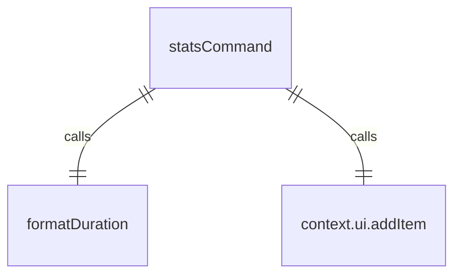
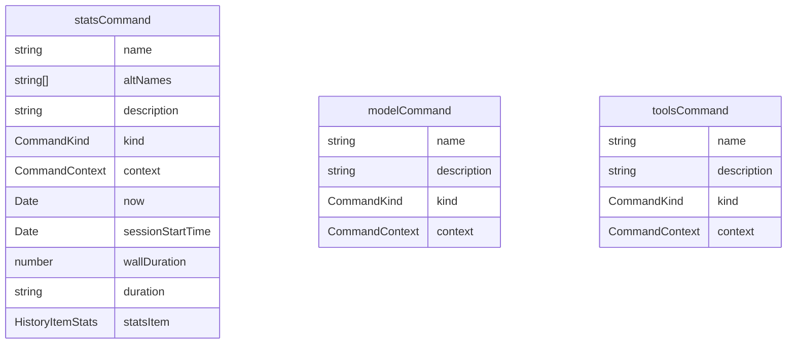

# statsCommand.ts

这个文件定义了 `/stats` 斜杠命令及其子命令，用于检查会话统计信息。

## 功能概述

1. 导出 `statsCommand` 斜杠命令对象
2. 提供检查会话统计信息的功能
3. 支持模型和工具特定的统计信息

## 命令对象

### statsCommand
- `name`：命令名称（'stats'）
- `altNames`：别名数组（['usage']）
- `description`：命令描述（'check session stats. Usage: /stats [model|tools]'）
- `kind`：命令类型（`CommandKind.BUILT_IN`）
- `action`：命令执行函数
- `subCommands`：子命令数组（包含 model 和 tools 命令）

## 子命令

### model 命令
- `name`：'model'
- `description`：'Show model-specific usage statistics.'
- 显示模型特定的使用统计信息

### tools 命令
- `name`：'tools'
- `description`：'Show tool-specific usage statistics.'
- 显示工具特定的使用统计信息

## 依赖关系

- 依赖 `../types.js` 中的类型定义
- 依赖 `../utils/formatters.js` 中的 `formatDuration` 函数
- 依赖 `./types.js` 中的类型定义

## 功能详情

### statsCommand 功能
1. 获取当前时间和会话开始时间
2. 检查会话开始时间是否可用
3. 计算会话持续时间
4. 格式化持续时间
5. 创建统计历史记录项
6. 将统计项添加到 UI 历史记录中

### model 命令功能
1. 创建模型统计历史记录项
2. 将模型统计项添加到 UI 历史记录中

### tools 命令功能
1. 创建工具统计历史记录项
2. 将工具统计项添加到 UI 历史记录中

## 错误处理

- 处理会话开始时间不可用的情况

## 函数级调用关系

## 变量级调用关系

