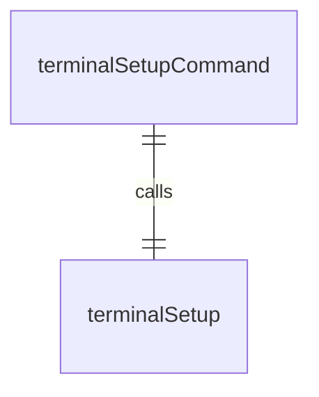
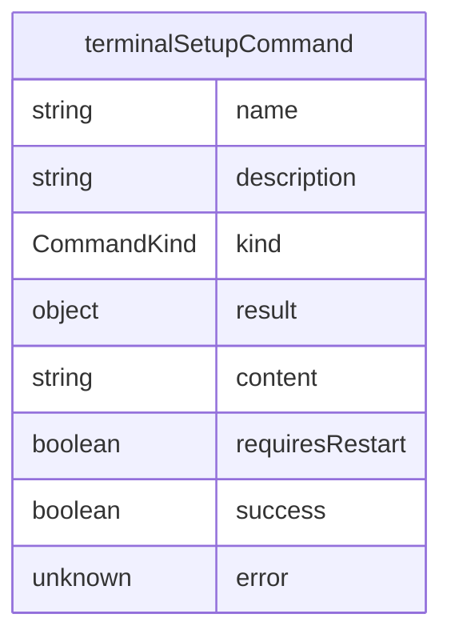

# terminalSetupCommand.ts

这个文件定义了 `/terminal-setup` 斜杠命令，用于配置终端按键绑定以支持多行输入。

## 功能概述

1. 导出 `terminalSetupCommand` 斜杠命令对象
2. 提供配置终端按键绑定的功能
3. 支持 VS Code、Cursor 和 Windsurf 编辑器

## 命令对象

### terminalSetupCommand
- `name`：命令名称（'terminal-setup'）
- `description`：命令描述（'Configure terminal keybindings for multiline input (VS Code, Cursor, Windsurf)'）
- `kind`：命令类型（`CommandKind.BUILT_IN`）
- `action`：命令执行函数

## 依赖关系

- 依赖 `./types.js` 中的类型定义
- 依赖 `../utils/terminalSetup.js` 中的 `terminalSetup` 函数

## 功能详情

### terminalSetupCommand 功能
1. 调用 `terminalSetup` 函数执行终端配置
2. 处理配置结果
3. 如果需要重启，添加重启提示
4. 返回成功或错误消息

## 错误处理

- 捕获终端配置过程中的异常
- 返回详细的错误信息

## 函数级调用关系

## 变量级调用关系

