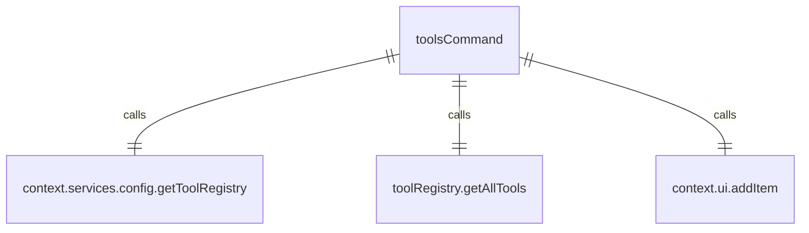

# toolsCommand.ts

这个文件定义了 `/tools` 斜杠命令，用于列出可用的 Gemini CLI 工具。

## 功能概述

1. 导出 `toolsCommand` 斜杠命令对象
2. 提供列出可用工具的功能
3. 支持显示工具描述

## 命令对象

### toolsCommand
- `name`：命令名称（'tools'）
- `description`：命令描述（'list available Gemini CLI tools. Usage: /tools [desc]'）
- `kind`：命令类型（`CommandKind.BUILT_IN`）
- `action`：命令执行函数

## 依赖关系

- 依赖 `./types.js` 中的类型定义
- 依赖 `../types.js` 中的 `MessageType` 枚举

## 功能详情

### toolsCommand 功能
1. 解析参数以确定是否显示描述
2. 获取工具注册表
3. 过滤出非 MCP 工具
4. 格式化工具列表
5. 如果需要，包含工具描述
6. 将工具列表添加到 UI 历史记录中

## 错误处理

- 处理工具注册表不可用的情况

## 函数级调用关系



## 变量级调用关系

```mermaid
erDiagram
    toolsCommand {
        string name
        string description
        CommandKind kind
        CommandContext context
        string | undefined args
        string | undefined subCommand
        boolean useShowDescriptions
        ToolRegistry | undefined toolRegistry
        Tool[] tools
        Tool[] geminiTools
        string message
        Tool tool
        string greenColor
        string resetColor
        string[] descLines
        string descLine
    }
```