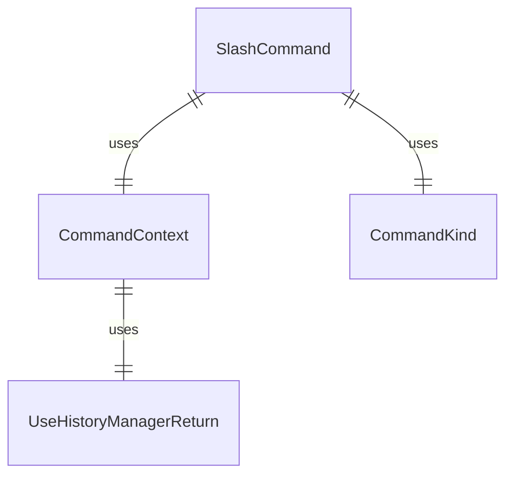

# types.ts

这个文件定义了 CLI 命令系统中使用的各种类型和接口。

## 功能概述

1. 定义命令上下文接口
2. 定义各种命令操作返回类型
3. 定义命令种类枚举
4. 定义斜杠命令接口

## 接口定义

### CommandContext
- 命令执行上下文接口
- 包含调用信息、服务、UI 状态和会话数据

#### invocation 属性
- `raw`：原始用户输入字符串
- `name`：匹配的命令名称
- `args`：命令参数字符串

#### services 属性
- `config`：配置对象（可能为 null）
- `settings`：加载的设置
- `git`：Git 服务（可选）
- `logger`：日志记录器

#### ui 属性
- `addItem`：添加历史记录项
- `clear`：清除历史记录和控制台屏幕
- `setDebugMessage`：设置调试消息
- `pendingItem`：当前待处理的历史记录项
- `setPendingItem`：设置待处理项
- `loadHistory`：加载历史记录
- `toggleCorgiMode`：切换柯基模式
- `toggleVimEnabled`：切换 Vim 模式
- `setGeminiMdFileCount`：设置 Gemini.md 文件数量
- `reloadCommands`：重新加载命令

#### session 属性
- `stats`：会话统计状态
- `sessionShellAllowlist`：会话 shell 白名单

#### overwriteConfirmed 属性
- 指示是否已确认覆盖的标志

### ToolActionReturn
- 工具操作返回类型
- 用于调度工具调用

### QuitActionReturn
- 退出操作返回类型
- 用于应用程序退出

### MessageActionReturn
- 消息操作返回类型
- 用于显示简单消息

### OpenDialogActionReturn
- 打开对话框操作返回类型
- 用于打开各种对话框

### LoadHistoryActionReturn
- 加载历史记录操作返回类型
- 用于替换整个对话历史

### SubmitPromptActionReturn
- 提交提示操作返回类型
- 用于立即提交内容作为提示

### ConfirmShellCommandsActionReturn
- 确认 shell 命令操作返回类型
- 用于请求 shell 命令确认

### ConfirmActionReturn
- 确认操作返回类型
- 用于请求用户确认

## 类型定义

### SlashCommandActionReturn
- 斜杠命令操作返回类型的联合类型

## 枚举定义

### CommandKind
- `BUILT_IN`：内置命令
- `FILE`：文件命令
- `MCP_PROMPT`：MCP 提示命令

## 斜杠命令接口

### SlashCommand
- 标准化的命令接口
- 包含命令名称、描述、种类等属性
- 支持别名、隐藏标志、扩展名称
- 包含操作函数和自动补全函数
- 支持子命令

## 依赖关系

- 依赖 React 的 `ReactNode` 类型
- 依赖 `@google/genai` 中的 `Content` 和 `PartListUnion` 类型
- 依赖 `../types.js` 中的历史记录类型
- 依赖 `@google/gemini-cli-core` 中的多个类型
- 依赖 `../../config/settings.js` 中的 `LoadedSettings` 类型
- 依赖 `../hooks/useHistoryManager.js` 中的 `UseHistoryManagerReturn` 类型
- 依赖 `../contexts/SessionContext.js` 中的 `SessionStatsState` 类型

## 函数级调用关系



## 变量级调用关系

```mermaid
erDiagram
    CommandContext {
        object | undefined invocation
        object services
        object ui
        object session
        boolean | undefined overwriteConfirmed
    }
    invocation {
        string raw
        string name
        string args
    }
    services {
        Config | null config
        LoadedSettings settings
        GitService | undefined git
        Logger logger
    }
    ui {
        function addItem
        function clear
        function setDebugMessage
        HistoryItemWithoutId | null pendingItem
        function setPendingItem
        function loadHistory
        function toggleCorgiMode
        function toggleVimEnabled
        function setGeminiMdFileCount
        function reloadCommands
    }
    session {
        SessionStatsState stats
        Set~string~ sessionShellAllowlist
    }
    ToolActionReturn {
        string type
        string toolName
        Record~string,unknown~ toolArgs
    }
    QuitActionReturn {
        string type
        HistoryItem[] messages
    }
    MessageActionReturn {
        string type
        "info" | "error" messageType
        string content
    }
    OpenDialogActionReturn {
        string type
        "help" | "auth" | "theme" | "editor" | "privacy" | "settings" dialog
    }
    LoadHistoryActionReturn {
        string type
        HistoryItemWithoutId[] history
        Content[] clientHistory
    }
    SubmitPromptActionReturn {
        string type
        PartListUnion content
    }
    ConfirmShellCommandsActionReturn {
        string type
        string[] commandsToConfirm
        object originalInvocation
        string raw
    }
    ConfirmActionReturn {
        string type
        ReactNode prompt
        object originalInvocation
        string raw
    }
    CommandKind {
        string BUILT_IN
        string FILE
        string MCP_PROMPT
    }
    SlashCommand {
        string name
        string[] | undefined altNames
        string description
        boolean | undefined hidden
        CommandKind kind
        string | undefined extensionName
        function | undefined action
        function | undefined completion
        SlashCommand[] | undefined subCommands
    }
```