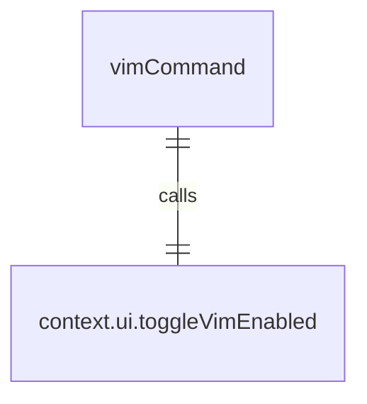
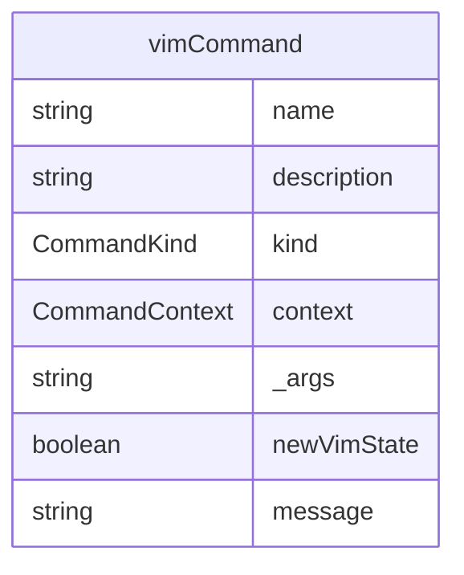

# vimCommand.ts

这个文件定义了 `/vim` 斜杠命令，用于切换 Vim 模式。

## 功能概述

1. 导出 `vimCommand` 斜杠命令对象
2. 提供切换 Vim 模式的功能

## 命令对象

### vimCommand
- `name`：命令名称（'vim'）
- `description`：命令描述（'toggle vim mode on/off'）
- `kind`：命令类型（`CommandKind.BUILT_IN`）
- `action`：命令执行函数

## 依赖关系

- 依赖 `./types.js` 中的类型定义

## 功能详情

### vimCommand 功能
1. 调用 `context.ui.toggleVimEnabled()` 切换 Vim 模式
2. 根据新状态生成相应的消息
3. 返回消息操作结果

## 函数级调用关系

## 变量级调用关系

