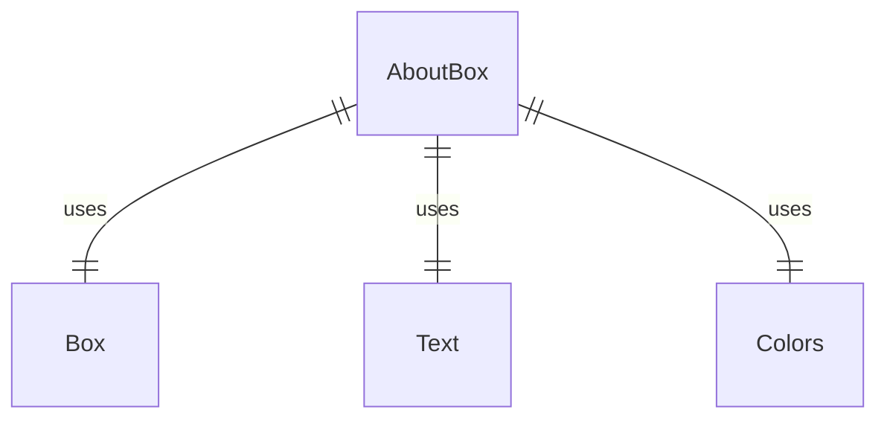
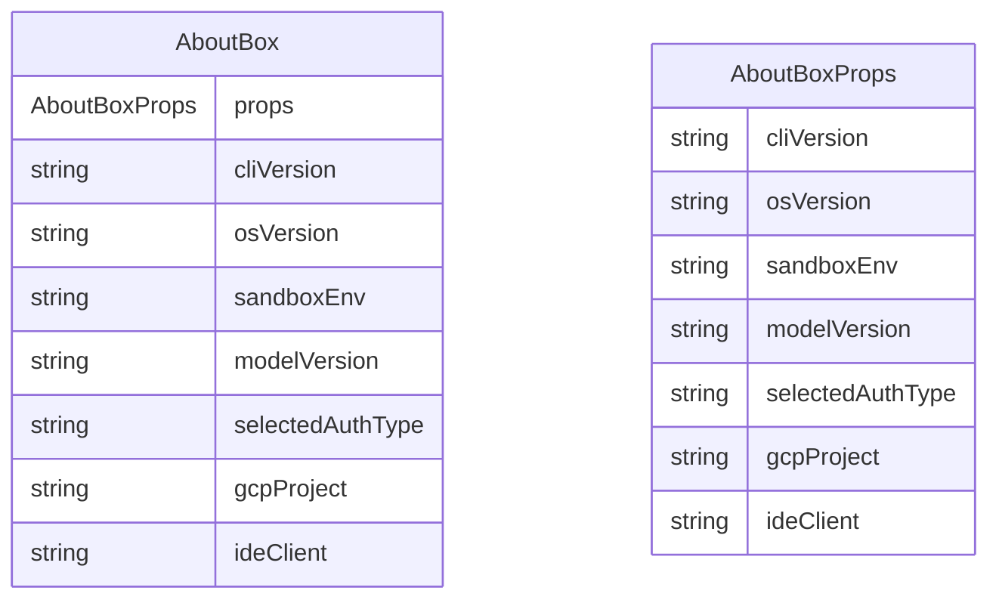

# AboutBox.tsx

这个文件定义了 AboutBox 组件，用于显示 Gemini CLI 的版本和配置信息。

## 功能概述

1. 导出 `AboutBox` React 函数组件
2. 显示 CLI 版本、Git 提交信息、模型版本等信息
3. 根据条件显示 GCP 项目和 IDE 客户端信息

## 组件结构

### AboutBox
- 接受多个属性参数显示系统和配置信息
- 使用 `ink` 库的 `Box` 和 `Text` 组件构建 UI
- 使用 `Colors` 主题颜色
- 显示 Git 提交信息（如果可用）

## 属性定义

### AboutBoxProps
- `cliVersion`：CLI 版本
- `osVersion`：操作系统版本
- `sandboxEnv`：沙箱环境
- `modelVersion`：模型版本
- `selectedAuthType`：选择的认证类型
- `gcpProject`：GCP 项目
- `ideClient`：IDE 客户端

## 依赖关系

- 依赖 React 类型定义
- 依赖 `ink` 中的 `Box` 和 `Text` 组件
- 依赖 `../colors.js` 中的颜色定义
- 依赖 `../../generated/git-commit.js` 中的 `GIT_COMMIT_INFO`

## 显示信息

1. CLI 版本
2. Git 提交信息（如果可用）
3. 模型版本
4. 沙箱环境
5. 操作系统版本
6. 认证方法
7. GCP 项目（如果配置）
8. IDE 客户端（如果连接）

## 函数级调用关系

## 变量级调用关系

