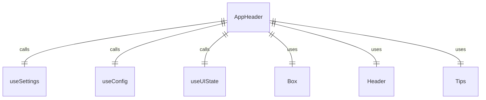
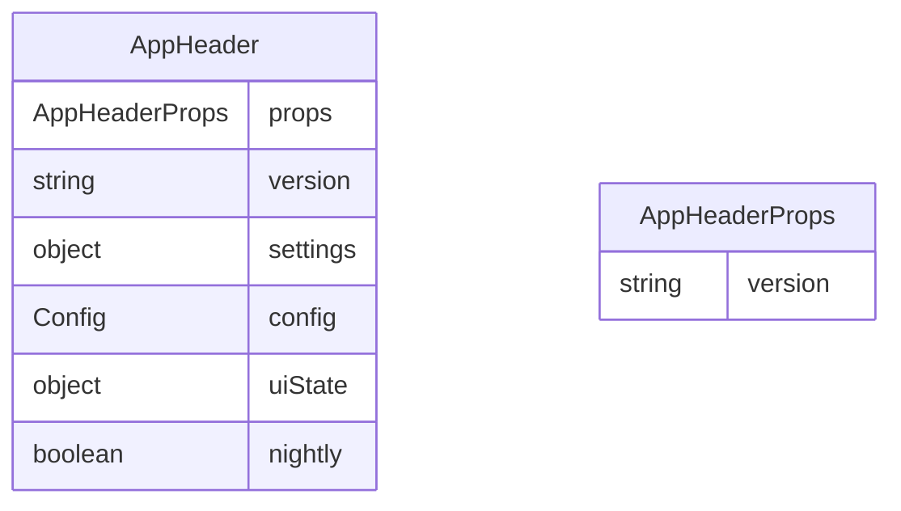

# AppHeader.tsx

这个文件定义了 AppHeader 组件，用于显示应用程序的头部信息。

## 功能概述

1. 导出 `AppHeader` React 函数组件
2. 显示应用程序头部和提示信息
3. 根据设置和配置控制显示内容

## 组件结构

### AppHeader
- 接受 `version` 属性参数
- 使用多个自定义钩子获取状态和配置
- 条件渲染头部和提示组件

## 属性定义

### AppHeaderProps
- `version`：应用程序版本

## 依赖关系

- 依赖 `ink` 中的 `Box` 组件
- 依赖 `./Header.js` 中的 `Header` 组件
- 依赖 `./Tips.js` 中的 `Tips` 组件
- 依赖 `../contexts/SettingsContext.js` 中的 `useSettings` 钩子
- 依赖 `../contexts/ConfigContext.js` 中的 `useConfig` 钩子
- 依赖 `../contexts/UIStateContext.js` 中的 `useUIState` 钩子

## 显示逻辑

1. 根据设置和配置决定是否显示头部
2. 根据设置和配置决定是否显示提示
3. 传递版本和夜间构建状态给头部组件
4. 传递配置给提示组件

## 函数级调用关系

## 变量级调用关系

