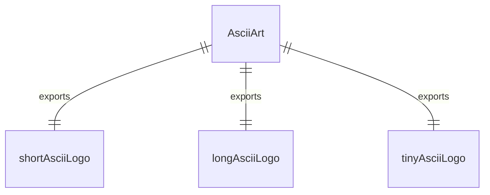
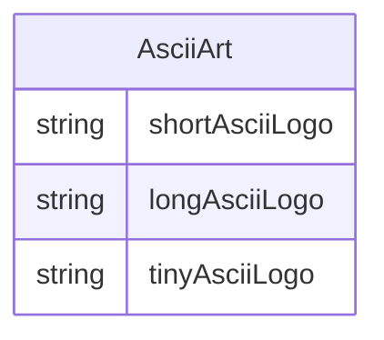

# AsciiArt.ts

ASCII艺术字模块，提供不同尺寸的Gemini CLI Logo ASCII艺术字。

## 功能概述

1. 提供三种不同尺寸的ASCII艺术字Logo
2. 用于在终端中显示品牌标识
3. 支持不同显示场景的需求

## 导出内容

### shortAsciiLogo
- 紧凑型ASCII艺术字Logo
- 适合空间有限的显示场景
- 包含完整的Gemini CLI文字标识

### longAsciiLogo
- 长型ASCII艺术字Logo
- 提供更宽的显示效果
- 在Logo前添加了装饰性元素

### tinyAsciiLogo
- 迷你型ASCII艺术字Logo
- 最小尺寸的Logo版本
- 适合极小空间的显示需求

## 使用场景

1. 应用程序启动时显示品牌标识
2. 帮助信息中显示Logo
3. 版本信息显示
4. 欢迎界面装饰

## 字符设计

- 使用Unicode字符█、░等创建视觉效果
- 通过字符的密度变化形成图案
- 保持Gemini CLI品牌视觉一致性

## 函数级调用关系

## 变量级调用关系

