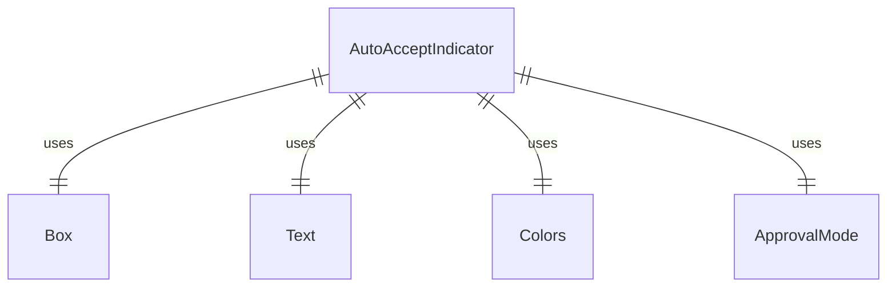
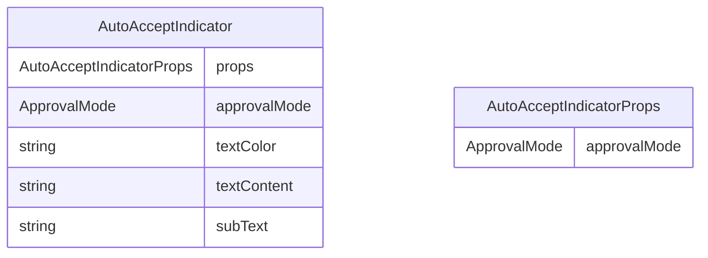

# AutoAcceptIndicator.tsx

这个文件定义了 AutoAcceptIndicator 组件，用于显示自动接受模式的指示器。

## 功能概述

1. 导出 `AutoAcceptIndicator` React 函数组件
2. 根据审批模式显示不同的指示信息
3. 提供切换模式的快捷键提示

## 组件结构

### AutoAcceptIndicator
- 接受 `approvalMode` 属性参数
- 根据审批模式设置文本颜色和内容
- 显示模式相关的子文本和快捷键提示

## 属性定义

### AutoAcceptIndicatorProps
- `approvalMode`：审批模式（ApprovalMode 枚举）

## 依赖关系

- 依赖 React 类型定义
- 依赖 `ink` 中的 `Box` 和 `Text` 组件
- 依赖 `../colors.js` 中的颜色定义
- 依赖 `@google/gemini-cli-core` 中的 `ApprovalMode` 枚举

## 显示逻辑

1. 根据 `approvalMode` 的值设置不同的显示内容：
   - `AUTO_EDIT`：显示"accepting edits"，绿色文本，快捷键提示 shift + tab
   - `YOLO`：显示"YOLO mode"，红色文本，快捷键提示 ctrl + y
   - `DEFAULT`：不显示任何内容
2. 使用主题颜色显示文本
3. 子文本使用灰色显示

## 函数级调用关系

## 变量级调用关系

