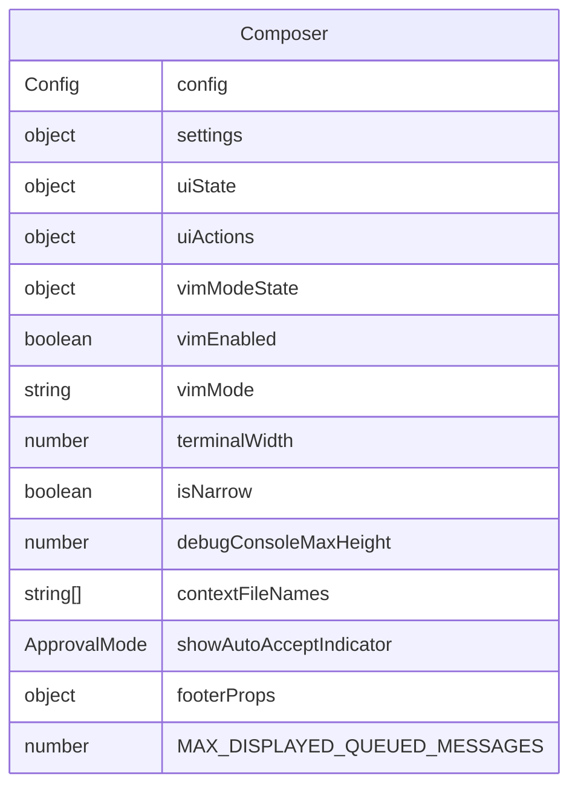

# Composer.tsx

这个文件定义了 Composer 组件，用于组合和显示应用程序的输入界面。

## 功能概述

1. 导出 `Composer` React 函数组件
2. 组合多个子组件构建完整的输入界面
3. 管理各种 UI 状态和交互

## 组件结构

### Composer
- 使用多个自定义钩子获取状态和配置
- 组合多个子组件构建界面
- 根据状态条件渲染不同内容

## 常量定义

### MAX_DISPLAYED_QUEUED_MESSAGES
- 定义最大显示的排队消息数量（3条）

## 依赖关系

- 依赖 `ink` 中的 `Box` 和 `Text` 组件
- 依赖多个本地组件（LoadingIndicator、ContextSummaryDisplay 等）
- 依赖多个上下文钩子（useUIState、useUIActions 等）
- 依赖 `../colors.js` 中的颜色定义
- 依赖 `../utils/isNarrowWidth.js` 中的 `isNarrowWidth` 函数
- 依赖 `@google/gemini-cli-core` 中的 `ApprovalMode` 枚举
- 依赖 `../types.js` 中的 `StreamingState` 枚举

## 组件组合

1. **LoadingIndicator**：显示加载指示器
2. **消息队列显示**：显示排队的消息预览
3. **上下文摘要显示**：显示上下文信息
4. **自动接受指示器**：显示自动接受模式状态
5. **Shell 模式指示器**：显示 Shell 模式状态
6. **详细消息显示**：显示调试控制台消息
7. **输入提示**：显示输入框和建议
8. **页脚**：显示状态信息

## 状态管理

- 获取配置和设置信息
- 获取 UI 状态和操作函数
- 获取 Vim 模式状态
- 计算终端宽度和窄屏状态
- 构建页脚属性

## 条件渲染逻辑

1. 根据流状态和可访问性设置显示加载短语
2. 根据消息队列长度显示排队消息
3. 根据窄屏状态调整布局方向
4. 根据不同状态显示提示信息（Ctrl+C、Ctrl+D、Esc）
5. 根据设置隐藏上下文摘要
6. 根据自动接受模式显示指示器
7. 根据错误详情显示状态显示调试控制台
8. 根据输入激活状态显示输入提示
9. 根据设置隐藏页脚

## 函数级调用关系

```mermaid
erDiagram
    Composer ||--|| useConfig : calls
    Composer ||--|| useSettings : calls
    Composer ||--|| useUIState : calls
    Composer ||--|| useUIActions : calls
    Composer ||--|| useVimMode : calls
    Composer ||--|| isNarrowWidth : calls
    Composer ||--|| Box : uses
    Composer ||--|| Text : uses
    Composer ||--|| LoadingIndicator : uses
    Composer ||--|| ContextSummaryDisplay : uses
    Composer ||--|| AutoAcceptIndicator : uses
    Composer ||--|| ShellModeIndicator : uses
    Composer ||--|| DetailedMessagesDisplay : uses
    Composer ||--|| InputPrompt : uses
    Composer ||--|| Footer : uses
    Composer ||--|| ShowMoreLines : uses
    Composer ||--|| OverflowProvider : uses
```

## 变量级调用关系

