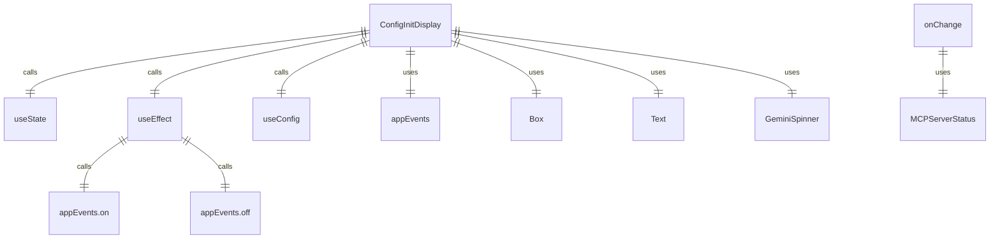
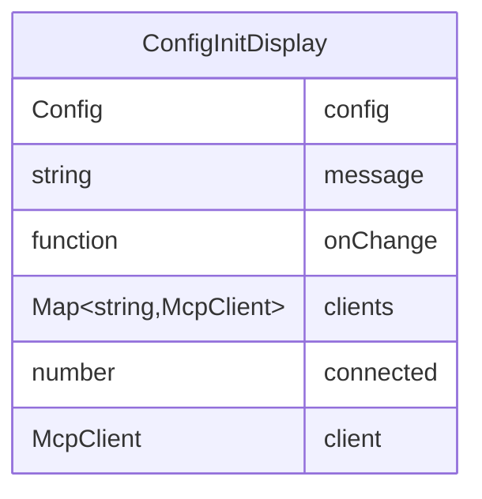

# ConfigInitDisplay.tsx

配置初始化显示组件，用于在应用程序启动时显示 MCP 服务器连接状态。

## 功能概述

1. 显示配置初始化状态
2. 显示 MCP 服务器连接进度
3. 提供用户友好的初始化反馈

## 组件结构

### ConfigInitDisplay
- 使用 React hooks 管理状态
- 监听 MCP 客户端更新事件
- 显示连接进度信息
- 使用 GeminiSpinner 组件显示加载动画

## 状态管理

- 使用 `useState` 管理显示消息
- 使用 `useEffect` 监听 MCP 客户端状态变化
- 使用 `useConfig` 获取配置上下文

## 事件处理

- 监听 `mcp-client-update` 事件
- 计算已连接的 MCP 服务器数量
- 更新显示消息以反映连接进度

## 依赖关系

- 依赖 `react` 的 `useEffect` 和 `useState`
- 依赖 `ink` 的 `Box` 和 `Text` 组件
- 依赖 `../contexts/ConfigContext.js` 的 `useConfig`
- 依赖 `@google/gemini-cli-core` 的 `McpClient` 和 `MCPServerStatus`
- 依赖 `./GeminiRespondingSpinner.js` 的 `GeminiSpinner`

## 函数级调用关系

## 变量级调用关系

