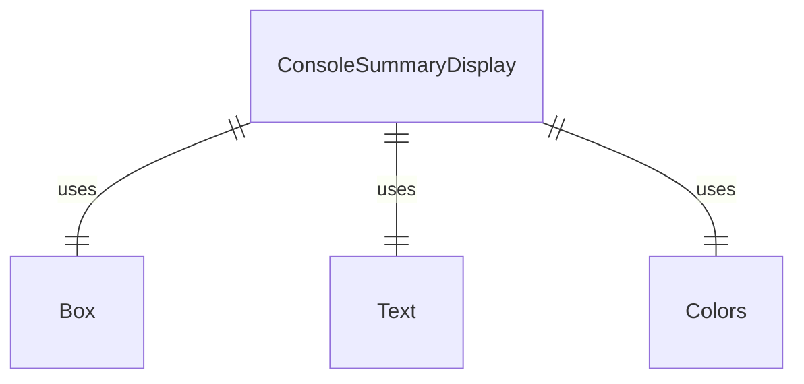
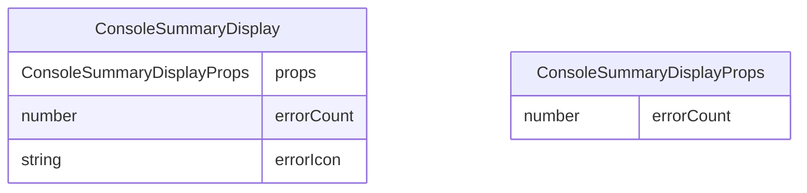

# ConsoleSummaryDisplay.tsx

这个文件定义了 ConsoleSummaryDisplay 组件，用于显示控制台错误摘要。

## 功能概述

1. 导出 `ConsoleSummaryDisplay` React 函数组件
2. 显示错误计数和相关提示信息
3. 根据错误数量显示不同的文本

## 组件结构

### ConsoleSummaryDisplay
- 接受 `errorCount` 属性参数
- 根据错误数量决定是否显示内容
- 使用图标和颜色增强视觉效果

## 属性定义

### ConsoleSummaryDisplayProps
- `errorCount`：错误数量

## 依赖关系

- 依赖 React 类型定义
- 依赖 `ink` 中的 `Box` 和 `Text` 组件
- 依赖 `../colors.js` 中的颜色定义

## 显示逻辑

1. 如果错误数量为 0，返回 null（不显示任何内容）
2. 使用乘法符号（✖）作为错误图标
3. 显示错误数量，根据数量决定单复数形式
4. 显示快捷键提示（ctrl+o for details）
5. 使用红色显示错误信息，灰色显示快捷键提示

## 函数级调用关系

## 变量级调用关系

