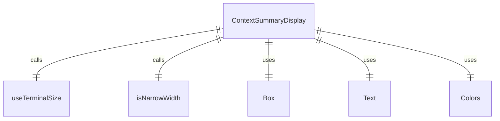

# ContextSummaryDisplay.tsx

这个文件定义了 ContextSummaryDisplay 组件，用于显示上下文摘要信息。

## 功能概述

1. 导出 `ContextSummaryDisplay` React 函数组件
2. 显示打开文件、上下文文件和 MCP 服务器的摘要信息
3. 根据终端宽度调整显示布局

## 组件结构

### ContextSummaryDisplay
- 接受多个属性参数显示上下文信息
- 使用终端尺寸钩子获取终端宽度
- 根据窄屏状态调整显示布局
- 条件渲染不同类型的上下文信息

## 属性定义

### ContextSummaryDisplayProps
- `geminiMdFileCount`：Gemini.md 文件数量
- `contextFileNames`：上下文文件名数组
- `mcpServers`：MCP 服务器配置记录（可选）
- `blockedMcpServers`：被阻止的 MCP 服务器数组（可选）
- `showToolDescriptions`：是否显示工具描述（可选）
- `ideContext`：IDE 上下文（可选）

## 依赖关系

- 依赖 React 类型定义
- 依赖 `ink` 中的 `Box` 和 `Text` 组件
- 依赖 `../colors.js` 中的颜色定义
- 依赖 `@google/gemini-cli-core` 中的类型定义
- 依赖 `../hooks/useTerminalSize.js` 中的 `useTerminalSize` 钩子
- 依赖 `../utils/isNarrowWidth.js` 中的 `isNarrowWidth` 函数

## 显示逻辑

1. **空状态处理**：如果没有上下文信息，显示空格以保留高度
2. **打开文件文本**：显示打开文件数量和查看快捷键
3. **Gemini.md 文本**：显示上下文文件数量和文件名
4. **MCP 文本**：显示 MCP 服务器和被阻止服务器数量，以及查看快捷键
5. **窄屏布局**：在窄屏上垂直显示信息
6. **宽屏布局**：在宽屏上水平显示信息，用竖线分隔

## 计算逻辑

1. 计算 MCP 服务器数量
2. 计算被阻止的 MCP 服务器数量
3. 计算打开文件数量
4. 判断是否为窄屏显示
5. 过滤空的摘要部分

## 函数级调用关系



## 变量级调用关系

```mermaid
erDiagram
    ContextSummaryDisplay {
        ContextSummaryDisplayProps props
        number geminiMdFileCount
        string[] contextFileNames
        Record~string,MCPServerConfig~ | undefined mcpServers
        Array~object~ | undefined blockedMcpServers
        boolean | undefined showToolDescriptions
        IdeContext | undefined ideContext
        number terminalWidth
        boolean isNarrow
        number mcpServerCount
        number blockedMcpServerCount
        number openFileCount
        string openFilesText
        string geminiMdText
        string mcpText
        string[] parts
        string[] summaryParts
    }
    ContextSummaryDisplayProps {
        number geminiMdFileCount
        string[] contextFileNames
        Record~string,MCPServerConfig~ | undefined mcpServers
        Array~object~ | undefined blockedMcpServers
        boolean | undefined showToolDescriptions
        IdeContext | undefined ideContext
    }
```