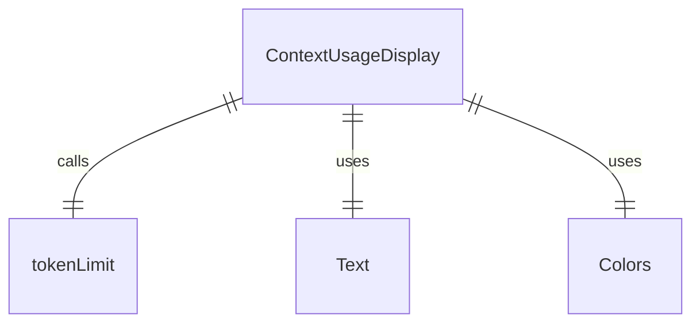
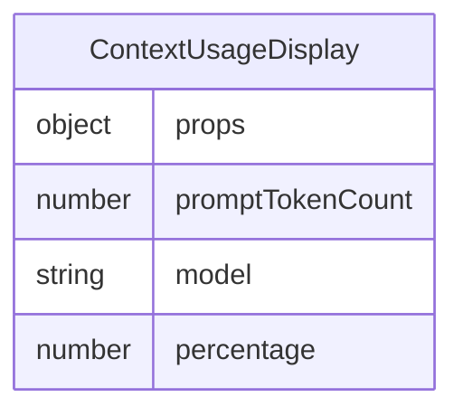

# ContextUsageDisplay.tsx

这个文件定义了 ContextUsageDisplay 组件，用于显示上下文使用情况。

## 功能概述

1. 导出 `ContextUsageDisplay` React 函数组件
2. 显示剩余上下文百分比
3. 根据模型和提示令牌数计算使用率

## 组件结构

### ContextUsageDisplay
- 接受 `promptTokenCount` 和 `model` 属性参数
- 计算上下文使用百分比
- 显示剩余上下文百分比

## 属性定义

### ContextUsageDisplayProps
- `promptTokenCount`：提示令牌数量
- `model`：模型名称

## 依赖关系

- 依赖 `ink` 中的 `Text` 组件
- 依赖 `../colors.js` 中的颜色定义
- 依赖 `@google/gemini-cli-core` 中的 `tokenLimit` 函数

## 显示逻辑

1. 使用 `tokenLimit` 函数获取模型的令牌限制
2. 计算已使用令牌占总令牌的百分比
3. 计算剩余上下文百分比
4. 格式化为整数百分比显示
5. 使用灰色文本显示

## 函数级调用关系

## 变量级调用关系

