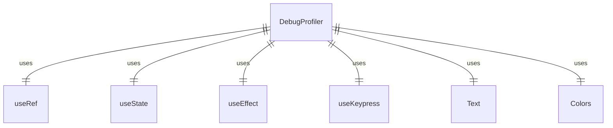
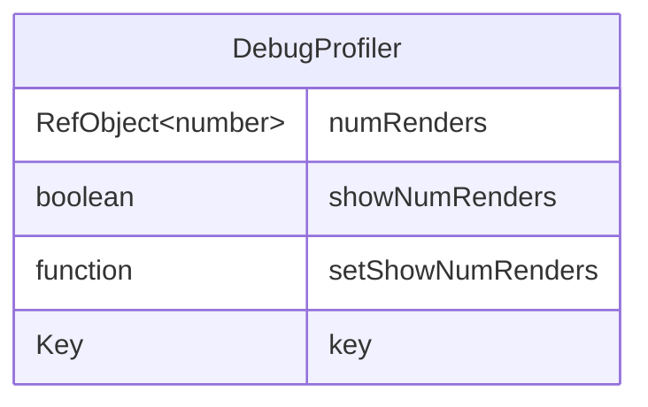

# DebugProfiler.tsx

这个文件定义了 DebugProfiler 组件，用于调试和显示组件渲染次数。

## 功能概述

1. 导出 `DebugProfiler` React 函数组件
2. 跟踪和显示组件渲染次数
3. 通过快捷键切换显示状态

## 组件结构

### DebugProfiler
- 使用 `useRef` 跟踪渲染次数
- 使用 `useState` 管理显示状态
- 使用 `useEffect` 在每次渲染时增加计数
- 使用 `useKeypress` 监听键盘事件

## 依赖关系

- 依赖 `ink` 中的 `Text` 组件
- 依赖 React 的 `useEffect`、`useRef` 和 `useState` 钩子
- 依赖 `../colors.js` 中的颜色定义
- 依赖 `../hooks/useKeypress.js` 中的 `useKeypress` 钩子

## 功能详情

1. **渲染计数**：使用 ref 跟踪组件渲染次数，在每次渲染时递增
2. **显示切换**：使用状态管理是否显示渲染计数
3. **键盘快捷键**：监听 Ctrl+B 组合键切换显示状态
4. **条件渲染**：根据显示状态决定是否渲染计数文本

## 函数级调用关系

## 变量级调用关系

