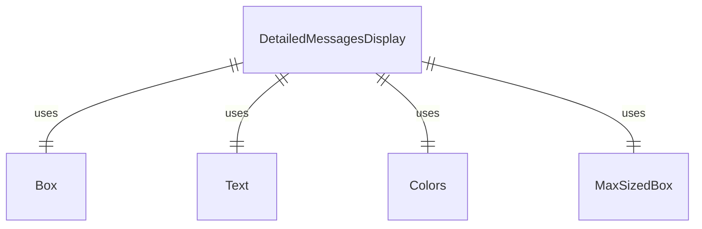

# DetailedMessagesDisplay.tsx

这个文件定义了 DetailedMessagesDisplay 组件，用于显示详细的控制台消息。

## 功能概述

1. 导出 `DetailedMessagesDisplay` React 函数组件
2. 显示控制台消息的详细信息
3. 根据消息类型使用不同的颜色和图标

## 组件结构

### DetailedMessagesDisplay
- 接受消息数组、最大高度和宽度属性
- 使用 MaxSizedBox 组件限制显示区域
- 根据消息类型设置不同的颜色和图标

## 属性定义

### DetailedMessagesDisplayProps
- `messages`：控制台消息项数组
- `maxHeight`：最大高度（可选）
- `width`：宽度

## 依赖关系

- 依赖 React 类型定义
- 依赖 `ink` 中的 `Box` 和 `Text` 组件
- 依赖 `../colors.js` 中的颜色定义
- 依赖 `../types.js` 中的 `ConsoleMessageItem` 类型
- 依赖 `./shared/MaxSizedBox.js` 中的 `MaxSizedBox` 组件

## 显示逻辑

1. **空状态处理**：如果没有消息，返回 null
2. **边框和内边距计算**：计算边框和内边距占用的空间
3. **标题显示**：显示"Debug Console"标题和关闭快捷键提示
4. **消息列表显示**：
   - 使用 MaxSizedBox 限制显示区域
   - 根据消息类型设置颜色和图标：
     - warn：黄色文本，警告图标（⚠）
     - error：红色文本，错误图标（✖）
     - debug：灰色文本，放大镜图标（🔍）
     - log：默认颜色，信息图标（ℹ）
   - 显示消息内容和重复次数（如果大于1）

## 函数级调用关系



## 变量级调用关系

```mermaid
erDiagram
    DetailedMessagesDisplay {
        DetailedMessagesDisplayProps props
        ConsoleMessageItem[] messages
        number | undefined maxHeight
        number width
        number borderAndPadding
        ConsoleMessageItem msg
        number index
        string textColor
        string icon
    }
    DetailedMessagesDisplayProps {
        ConsoleMessageItem[] messages
        number | undefined maxHeight
        number width
    }
```