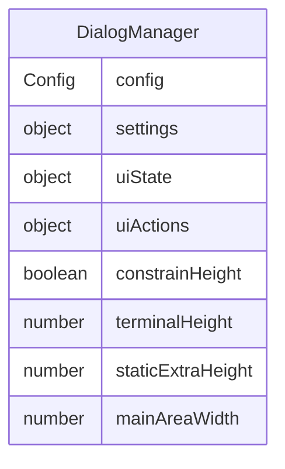

# DialogManager.tsx

这个文件定义了 DialogManager 组件，用于管理应用程序中的各种对话框。

## 功能概述

1. 导出 `DialogManager` React 函数组件
2. 根据 UI 状态条件渲染不同的对话框组件
3. 管理对话框的显示优先级和交互

## 组件结构

### DialogManager
- 使用多个自定义钩子获取状态和配置
- 根据 UI 状态条件渲染相应的对话框
- 传递必要的属性和回调函数给对话框组件

## 依赖关系

- 依赖 `ink` 中的 `Box` 和 `Text` 组件
- 依赖多个本地对话框组件
- 依赖多个上下文钩子（useUIState、useUIActions、useConfig、useSettings）
- 依赖 `../colors.js` 中的颜色定义
- 依赖 `@google/gemini-cli-core` 中的 `DEFAULT_GEMINI_FLASH_MODEL`
- 依赖 Node.js 的 `process` 模块

## 对话框管理

按优先级顺序渲染以下对话框：

1. **IDE 重启提示**：显示工作区信任变更后的重启提示
2. **工作区迁移对话框**：处理工作区扩展迁移
3. **Pro 配额对话框**：处理 Pro 模型配额限制
4. **IDE 集成提示**：提示用户连接 IDE
5. **文件夹信任对话框**：处理文件夹信任设置
6. **Shell 确认对话框**：确认 Shell 命令执行
7. **确认对话框**：通用确认对话框
8. **主题对话框**：主题选择和设置
9. **设置对话框**：应用程序设置
10. **认证进行中**：显示认证过程状态
11. **认证对话框**：认证方法选择
12. **编辑器设置对话框**：外部编辑器设置
13. **隐私声明**：显示隐私政策

## 属性传递

- 向对话框组件传递必要的状态和操作函数
- 传递配置和设置信息
- 传递终端尺寸信息用于布局计算

## 函数级调用关系

```mermaid
erDiagram
    DialogManager ||--|| useConfig : calls
    DialogManager ||--|| useSettings : calls
    DialogManager ||--|| useUIState : calls
    DialogManager ||--|| useUIActions : calls
    DialogManager ||--|| Box : uses
    DialogManager ||--|| Text : uses
    DialogManager ||--|| IdeIntegrationNudge : uses
    DialogManager ||--|| FolderTrustDialog : uses
    DialogManager ||--|| ShellConfirmationDialog : uses
    DialogManager ||--|| RadioButtonSelect : uses
    DialogManager ||--|| ThemeDialog : uses
    DialogManager ||--|| SettingsDialog : uses
    DialogManager ||--|| AuthInProgress : uses
    DialogManager ||--|| AuthDialog : uses
    DialogManager ||--|| EditorSettingsDialog : uses
    DialogManager ||--|| PrivacyNotice : uses
    DialogManager ||--|| WorkspaceMigrationDialog : uses
    DialogManager ||--|| ProQuotaDialog : uses
    DialogManager ||--|| Colors : uses
```

## 变量级调用关系

