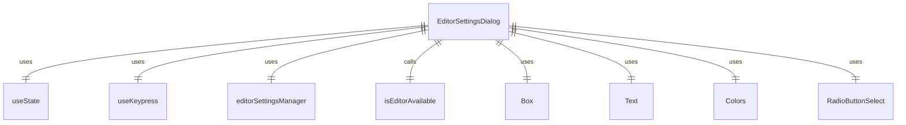

# EditorSettingsDialog.tsx

这个文件定义了 EditorSettingsDialog 组件，用于设置外部编辑器偏好。

## 功能概述

1. 导出 `EditorSettingsDialog` React 函数组件
2. 提供编辑器选择和应用范围设置功能
3. 显示当前编辑器偏好和可用编辑器列表

## 组件结构

### EditorSettingsDialog
- 接受选择回调、设置和退出回调属性
- 使用状态管理选择范围和焦点部分
- 使用键盘钩子处理 Tab 和 Escape 键
- 显示编辑器选择和范围选择界面

## 属性定义

### EditorDialogProps
- `onSelect`：编辑器选择回调函数
- `settings`：加载的设置对象
- `onExit`：退出对话框回调函数

## 依赖关系

- 依赖 React 类型定义和 `useState` 钩子
- 依赖 `ink` 中的 `Box` 和 `Text` 组件
- 依赖 `../colors.js` 中的颜色定义
- 依赖 `../editors/editorSettingsManager.js` 中的编辑器管理功能
- 依赖 `./shared/RadioButtonSelect.js` 中的单选按钮组件
- 依赖 `../../config/settings.js` 中的设置类型和枚举
- 依赖 `@google/gemini-cli-core` 中的编辑器类型和可用性检查
- 依赖 `../hooks/useKeypress.js` 中的键盘钩子

## 功能详情

1. **状态管理**：
   - `selectedScope`：当前选择的应用范围（用户或工作区）
   - `focusedSection`：当前焦点部分（编辑器或范围）

2. **键盘交互**：
   - Tab 键：在编辑器选择和范围选择之间切换焦点
   - Escape 键：退出对话框

3. **编辑器列表**：
   - 获取可用编辑器显示列表
   - 根据当前设置确定默认选择索引
   - 处理不支持的编辑器类型

4. **范围选择**：
   - 提供用户设置和工作区设置两个选项
   - 显示其他范围的修改状态

5. **当前偏好显示**：
   - 显示合并后的编辑器偏好设置
   - 根据编辑器可用性设置不同颜色

6. **界面布局**：
   - 左侧：编辑器选择和范围选择区域
   - 右侧：编辑器偏好信息和说明

## 函数级调用关系



## 变量级调用关系

```mermaid
erDiagram
    EditorSettingsDialog {
        EditorDialogProps props
        function onSelect
        LoadedSettings settings
        function onExit
        SettingScope selectedScope
        function setSelectedScope
        "editor" | "scope" focusedSection
        function setFocusedSection
        Key key
        EditorDisplay[] editorItems
        string | undefined currentPreference
        number editorIndex
        Array~object~ scopeItems
        SettingScope otherScope
        string otherScopeModifiedMessage
        string mergedEditorName
    }
    EditorDialogProps {
        function onSelect
        LoadedSettings settings
        function onExit
    }
```