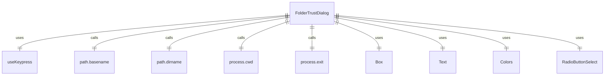

# FolderTrustDialog.tsx

这个文件定义了 FolderTrustDialog 组件，用于处理文件夹信任设置。

## 功能概述

1. 导出 `FolderTrustDialog` React 函数组件
2. 提供文件夹信任选择功能
3. 显示信任说明和安全警告

## 组件结构

### FolderTrustDialog
- 接受选择回调和重启状态属性
- 使用键盘钩子处理 Escape 和 R 键
- 显示信任选项和说明文本
- 根据重启状态显示重启提示

## 枚举定义

### FolderTrustChoice
- `TRUST_FOLDER`：信任当前文件夹
- `TRUST_PARENT`：信任父文件夹
- `DO_NOT_TRUST`：不信任

## 属性定义

### FolderTrustDialogProps
- `onSelect`：选择回调函数
- `isRestarting`：是否正在重启（可选）

## 依赖关系

- 依赖 `ink` 中的 `Box` 和 `Text` 组件
- 依赖 React 类型定义
- 依赖 `../colors.js` 中的颜色定义
- 依赖 `./shared/RadioButtonSelect.js` 中的单选按钮组件
- 依赖 `../hooks/useKeypress.js` 中的键盘钩子
- 依赖 Node.js 的 `process` 和 `path` 模块

## 功能详情

1. **键盘交互**：
   - Escape 键：选择"不信任"
   - R 键：在重启状态下退出进程

2. **信任选项**：
   - 信任当前文件夹
   - 信任父文件夹（显示父文件夹名称）
   - 不信任（Escape 键快捷方式）

3. **安全说明**：
   - 解释信任文件夹的作用
   - 说明这是防止在不受信任目录中意外执行的安全功能

4. **重启提示**：
   - 在重启状态下显示重启提示
   - 提示用户按 R 键退出并应用更改

## 函数级调用关系



## 变量级调用关系

```mermaid
erDiagram
    FolderTrustDialog {
        FolderTrustDialogProps props
        function onSelect
        boolean | undefined isRestarting
        Key key
        string parentFolder
        RadioSelectItem~FolderTrustChoice~[] options
        FolderTrustChoice value
    }
    FolderTrustDialogProps {
        function onSelect
        boolean | undefined isRestarting
    }
    FolderTrustChoice {
        string TRUST_FOLDER
        string TRUST_PARENT
        string DO_NOT_TRUST
    }
```