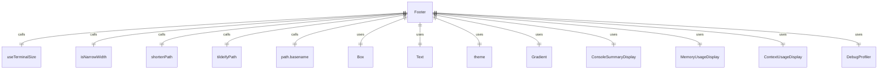

# Footer.tsx

这个文件定义了 Footer 组件，用于显示应用程序的页脚信息。

## 功能概述

1. 导出 `Footer` React 函数组件
2. 显示路径、分支、模型、错误计数等页脚信息
3. 根据终端宽度调整布局和内容显示

## 组件结构

### Footer
- 接受多个属性参数显示页脚信息
- 使用终端尺寸钩子获取终端宽度
- 根据窄屏状态调整布局方向
- 条件渲染不同部分的内容

## 接口定义

### FooterProps
- `model`：模型名称
- `targetDir`：目标目录路径
- `branchName`：分支名称（可选）
- `debugMode`：调试模式状态
- `debugMessage`：调试消息
- `corgiMode`：柯基模式状态
- `errorCount`：错误计数
- `showErrorDetails`：是否显示错误详情
- `showMemoryUsage`：是否显示内存使用情况（可选）
- `promptTokenCount`：提示令牌数
- `nightly`：夜间构建状态
- `vimMode`：Vim 模式（可选）
- `isTrustedFolder`：是否为受信任文件夹（可选）

## 依赖关系

- 依赖 React 类型定义
- 依赖 `ink` 中的 `Box` 和 `Text` 组件
- 依赖 `../semantic-colors.js` 中的主题颜色
- 依赖 `@google/gemini-cli-core` 中的路径处理函数
- 依赖多个本地组件（ConsoleSummaryDisplay、MemoryUsageDisplay 等）
- 依赖 Node.js 的 `process` 和 `path` 模块
- 依赖 `ink-gradient` 中的 `Gradient` 组件
- 依赖 `../hooks/useTerminalSize.js` 中的终端尺寸钩子
- 依赖 `../utils/isNarrowWidth.js` 中的窄屏判断函数

## 功能详情

1. **路径显示**：
   - 根据终端宽度调整路径显示长度
   - 窄屏时只显示目录名
   - 宽屏时显示缩短的完整路径
   - 使用波浪号替换用户目录路径

2. **布局管理**：
   - 根据窄屏状态调整布局方向（列或行）
   - 左侧：调试信息、Vim 模式、路径和分支
   - 中间：信任/沙箱信息
   - 右侧：模型信息、内存使用、错误计数

3. **条件渲染**：
   - 调试模式下显示调试分析器和调试消息
   - Vim 模式下显示模式状态
   - 夜间构建使用渐变色显示路径
   - 柯基模式下显示特殊图标
   - 根据错误详情显示状态决定是否显示错误摘要

4. **信任和沙箱信息**：
   - 显示文件夹信任状态
   - 显示沙箱环境信息
   - 显示 macOS Seatbelt 配置
   - 无沙箱时显示警告

5. **模型和上下文信息**：
   - 显示当前模型名称
   - 显示上下文使用情况
   - 根据设置显示内存使用情况

## 函数级调用关系



## 变量级调用关系

```mermaid
erDiagram
    Footer {
        FooterProps props
        string model
        string targetDir
        string | undefined branchName
        boolean debugMode
        string debugMessage
        boolean corgiMode
        number errorCount
        boolean showErrorDetails
        boolean | undefined showMemoryUsage
        number promptTokenCount
        boolean nightly
        string | undefined vimMode
        boolean | undefined isTrustedFolder
        number terminalWidth
        boolean isNarrow
        number pathLength
        string displayPath
    }
    FooterProps {
        string model
        string targetDir
        string | undefined branchName
        boolean debugMode
        string debugMessage
        boolean corgiMode
        number errorCount
        boolean showErrorDetails
        boolean | undefined showMemoryUsage
        number promptTokenCount
        boolean nightly
        string | undefined vimMode
        boolean | undefined isTrustedFolder
    }
```