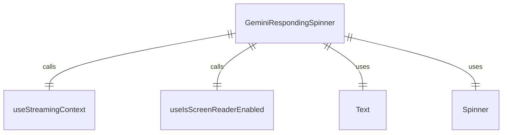

# GeminiRespondingSpinner.tsx

这个文件定义了 GeminiRespondingSpinner 组件，用于显示 Gemini 响应状态的加载动画。

## 功能概述

1. 导出 `GeminiRespondingSpinner` React 函数组件
2. 根据流状态显示加载动画或文本
3. 支持屏幕阅读器模式

## 组件结构

### GeminiRespondingSpinner
- 接受可选的非响应显示文本和加载器类型属性
- 使用流上下文获取当前流状态
- 使用屏幕阅读器钩子检测屏幕阅读器状态
- 根据状态和屏幕阅读器支持显示不同内容

## 属性定义

### GeminiRespondingSpinnerProps
- `nonRespondingDisplay`：非响应状态时显示的可选文本
- `spinnerType`：加载器类型（默认为 'dots'）

## 依赖关系

- 依赖 React 类型定义
- 依赖 `ink` 中的 `Text` 组件和屏幕阅读器钩子
- 依赖 `ink-spinner` 中的 `Spinner` 组件
- 依赖 `cli-spinners` 中的 `SpinnerName` 类型
- 依赖 `../contexts/StreamingContext.js` 中的流上下文钩子
- 依赖 `../types.js` 中的 `StreamingState` 枚举
- 依赖 `../textConstants.js` 中的屏幕阅读器常量

## 显示逻辑

1. **响应状态**：
   - 屏幕阅读器启用：显示 "responding" 文本
   - 屏幕阅读器禁用：显示指定类型的加载动画

2. **非响应状态**：
   - 提供了非响应显示文本：
     - 屏幕阅读器启用：显示 "loading" 文本
     - 屏幕阅读器禁用：显示提供的文本
   - 未提供非响应显示文本：返回 null

## 函数级调用关系



## 变量级调用关系

```mermaid
erDiagram
    GeminiRespondingSpinner {
        GeminiRespondingSpinnerProps props
        string | undefined nonRespondingDisplay
        SpinnerName spinnerType
        StreamingState streamingState
        boolean isScreenReaderEnabled
    }
    GeminiRespondingSpinnerProps {
        string | undefined nonRespondingDisplay
        SpinnerName | undefined spinnerType
    }
```