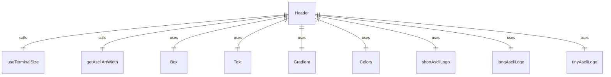

# Header.tsx

这个文件定义了 Header 组件，用于显示应用程序的头部 ASCII 艺术 Logo。

## 功能概述

1. 导出 `Header` React 函数组件
2. 根据终端宽度显示不同尺寸的 ASCII Logo
3. 支持自定义 ASCII 艺术和夜间构建版本显示

## 组件结构

### Header
- 接受自定义 ASCII 艺术、版本和夜间构建状态属性
- 使用终端尺寸钩子获取终端宽度
- 根据终端宽度选择合适的 Logo 尺寸
- 使用渐变色显示 Logo（如果主题支持）

## 属性定义

### HeaderProps
- `customAsciiArt`：自定义 ASCII 艺术（可选）
- `version`：应用程序版本
- `nightly`：夜间构建状态

## 依赖关系

- 依赖 React 类型定义
- 依赖 `ink` 中的 `Box` 和 `Text` 组件
- 依赖 `ink-gradient` 中的 `Gradient` 组件
- 依赖 `../colors.js` 中的颜色定义
- 依赖 `./AsciiArt.js` 中的 Logo 定义
- 依赖 `../utils/textUtils.js` 中的文本工具函数
- 依赖 `../hooks/useTerminalSize.js` 中的终端尺寸钩子

## 显示逻辑

1. **Logo 选择**：
   - 如果提供了自定义 ASCII 艺术，使用自定义艺术
   - 终端宽度 >= 长 Logo 宽度：使用长 Logo
   - 终端宽度 >= 短 Logo 宽度：使用短 Logo
   - 否则：使用微型 Logo

2. **渐变显示**：
   - 如果主题支持渐变色，使用 Gradient 组件显示 Logo
   - 否则直接显示文本

3. **版本显示**：
   - 夜间构建版本在 Logo 右侧显示版本号
   - 使用相同渐变色处理（如果支持）

## 函数级调用关系



## 变量级调用关系

```mermaid
erDiagram
    Header {
        HeaderProps props
        string | undefined customAsciiArt
        string version
        boolean nightly
        number terminalWidth
        string displayTitle
        number widthOfLongLogo
        number widthOfShortLogo
        number artWidth
    }
    HeaderProps {
        string | undefined customAsciiArt
        string version
        boolean nightly
    }
```