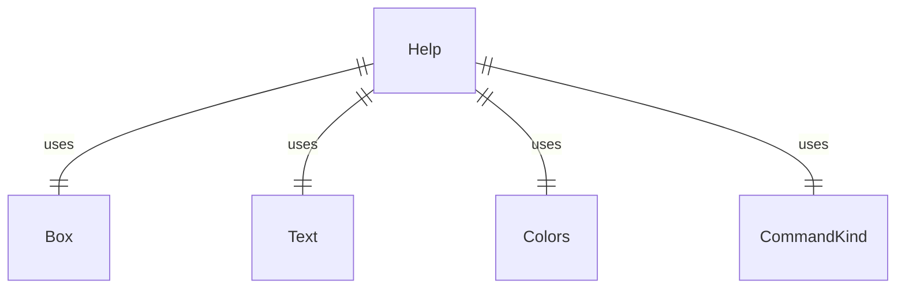

# Help.tsx

这个文件定义了 Help 组件，用于显示应用程序的帮助信息。

## 功能概述

1. 导出 `Help` React 函数组件
2. 显示基本用法、命令列表和键盘快捷键
3. 根据命令类型和平台显示不同信息

## 组件结构

### Help
- 接受命令数组属性
- 显示三个主要部分：基本用法、命令列表、键盘快捷键
- 根据命令属性过滤和格式化显示

## 接口定义

### Help
- `commands`：只读斜杠命令数组

## 依赖关系

- 依赖 React 类型定义
- 依赖 `ink` 中的 `Box` 和 `Text` 组件
- 依赖 `../colors.js` 中的颜色定义
- 依赖 `../commands/types.js` 中的命令类型和枚举

## 显示内容

1. **基本用法**：
   - 上下文添加：使用 @ 符号指定文件
   - Shell 模式：使用 ! 符号执行命令

2. **命令列表**：
   - 过滤隐藏和无描述的命令
   - 显示命令名称和描述
   - 标记 MCP 命令类型
   - 显示子命令（如果存在）
   - 特殊标记 Shell 命令和 MCP 命令说明

3. **键盘快捷键**：
   - 根据平台显示不同的快捷键：
     - Alt+Left/Right：单词跳转
     - Ctrl+C：退出应用
     - Ctrl+Enter/Ctrl+J：换行
     - Ctrl+L：清屏
     - Ctrl+X/Meta+Enter：外部编辑器
     - Ctrl+Y：切换 YOLO 模式
     - Enter：发送消息
     - Esc：取消操作/清空输入
     - Shift+Tab：切换自动接受编辑
     - Up/Down：历史记录循环
   - 提供完整快捷键列表文档链接

## 函数级调用关系



## 变量级调用关系

```mermaid
erDiagram
    Help {
        HelpProps props
        readonly SlashCommand[] commands
        SlashCommand command
        SlashCommand subCommand
    }
    HelpProps {
        readonly SlashCommand[] commands
    }
```