# HistoryItemDisplay.tsx

这个文件定义了 HistoryItemDisplay 组件，用于显示不同类型的历史记录项。

## 功能概述

1. 导出 `HistoryItemDisplay` React 函数组件
2. 根据历史记录项类型渲染相应的显示组件
3. 传递必要的属性给子组件

## 组件结构

### HistoryItemDisplay
- 接受历史记录项和显示相关属性
- 使用条件渲染显示不同类型的项
- 传递终端尺寸和状态信息给子组件

## 属性定义

### HistoryItemDisplayProps
- `item`：历史记录项
- `availableTerminalHeight`：可用终端高度（可选）
- `terminalWidth`：终端宽度
- `isPending`：是否为待处理状态
- `isFocused`：是否聚焦（默认为 true）
- `commands`：斜杠命令数组（可选）

## 依赖关系

- 依赖 React 类型定义
- 依赖 `../types.js` 中的历史记录项类型
- 依赖多个消息显示组件
- 依赖 `ink` 中的 `Box` 组件
- 依赖多个信息显示组件
- 依赖 `../commands/types.js` 中的命令类型

## 显示类型

1. **用户消息**：`UserMessage` 组件
2. **用户 Shell 消息**：`UserShellMessage` 组件
3. **Gemini 消息**：`GeminiMessage` 组件
4. **Gemini 内容消息**：`GeminiMessageContent` 组件
5. **信息消息**：`InfoMessage` 组件
6. **错误消息**：`ErrorMessage` 组件
7. **关于信息**：`AboutBox` 组件
8. **帮助信息**：`Help` 组件
9. **统计信息**：`StatsDisplay` 组件
10. **模型统计**：`ModelStatsDisplay` 组件
11. **工具统计**：`ToolStatsDisplay` 组件
12. **退出信息**：`SessionSummaryDisplay` 组件
13. **工具组消息**：`ToolGroupMessage` 组件
14. **压缩消息**：`CompressionMessage` 组件

## 属性传递

- 向消息组件传递文本内容
- 向 Gemini 相关组件传递待处理状态和终端尺寸
- 向工具组消息传递组 ID、终端尺寸和聚焦状态
- 向关于信息传递详细的系统信息
- 向帮助信息传递命令列表

## 函数级调用关系

```mermaid
erDiagram
    HistoryItemDisplay ||--|| Box : uses
    HistoryItemDisplay ||--|| UserMessage : uses
    HistoryItemDisplay ||--|| UserShellMessage : uses
    HistoryItemDisplay ||--|| GeminiMessage : uses
    HistoryItemDisplay ||--|| GeminiMessageContent : uses
    HistoryItemDisplay ||--|| InfoMessage : uses
    HistoryItemDisplay ||--|| ErrorMessage : uses
    HistoryItemDisplay ||--|| ToolGroupMessage : uses
    HistoryItemDisplay ||--|| AboutBox : uses
    HistoryItemDisplay ||--|| Help : uses
    HistoryItemDisplay ||--|| StatsDisplay : uses
    HistoryItemDisplay ||--|| ModelStatsDisplay : uses
    HistoryItemDisplay ||--|| ToolStatsDisplay : uses
    HistoryItemDisplay ||--|| SessionSummaryDisplay : uses
    HistoryItemDisplay ||--|| CompressionMessage : uses
```



## 变量级调用关系

```mermaid
erDiagram
    HistoryItemDisplay {
        HistoryItemDisplayProps props
        HistoryItem item
        number | undefined availableTerminalHeight
        number terminalWidth
        boolean isPending
        readonly SlashCommand[] | undefined commands
        boolean isFocused
    }
    HistoryItemDisplayProps {
        HistoryItem item
        number | undefined availableTerminalHeight
        number terminalWidth
        boolean isPending
        boolean | undefined isFocused
        readonly SlashCommand[] | undefined commands
    }
```