# InputPrompt Component

## Overview
The `InputPrompt` component is a sophisticated text input component for the CLI interface that handles user input, history navigation, auto-completion, shell mode, and clipboard operations. It integrates with various hooks and utilities to provide a rich text editing experience in the terminal.

## Function Call Relationships

```mermaid
erDiagram
    InputPrompt ||--|{ useInputHistory : uses
    InputPrompt ||--|{ useShellHistory : uses
    InputPrompt ||--|{ useReverseSearchCompletion : uses
    InputPrompt ||--|{ useCommandCompletion : uses
    InputPrompt ||--|{ useKeypress : uses
    InputPrompt ||--|{ TextBuffer : interacts
    InputPrompt ||--|{ SuggestionsDisplay : renders
    InputPrompt ||--|{ keyMatchers : uses
    InputPrompt ||--|{ parseInputForHighlighting : uses
    InputPrompt ||--|{ clipboardUtils : uses
    InputPrompt ||--|{ textUtils : uses
    InputPrompt ||--|{ useTerminalSize : uses
    useKeypress ||--|{ handleInput : calls
    handleInput ||--|{ buffer.handleInput : calls
    handleInput ||--|{ handleSubmitAndClear : calls
    handleSubmitAndClear ||--|{ onSubmit : calls
    handleInput ||--|{ shellHistory.addCommandToHistory : calls
    handleInput ||--|{ resetCompletionState : calls
    handleInput ||--|{ resetReverseSearchCompletionState : calls
    handleInput ||--|{ completion.handleAutocomplete : calls
    handleInput ||--|{ reverseSearchCompletion.handleAutocomplete : calls
    handleInput ||--|{ inputHistory.navigateUp : calls
    handleInput ||--|{ inputHistory.navigateDown : calls
    handleInput ||--|{ shellHistory.getPreviousCommand : calls
    handleInput ||--|{ shellHistory.getNextCommand : calls
    handleInput ||--|{ buffer.setText : calls
    handleInput ||--|{ buffer.backspace : calls
    handleInput ||--|{ buffer.newline : calls
    handleInput ||--|{ buffer.move : calls
    handleInput ||--|{ buffer.killLineRight : calls
    handleInput ||--|{ buffer.killLineLeft : calls
    handleInput ||--|{ buffer.deleteWordLeft : calls
    handleInput ||--|{ buffer.openInExternalEditor : calls
    handleInput ||--|{ handleClipboardImage : calls
    handleInput ||--|{ completion.promptCompletion.accept : calls
    handleInput ||--|{ completion.promptCompletion.clear : calls
    handleClipboardImage ||--|{ clipboardHasImage : calls
    handleClipboardImage ||--|{ saveClipboardImage : calls
    handleClipboardImage ||--|{ cleanupOldClipboardImages : calls
    handleClipboardImage ||--|{ buffer.replaceRangeByOffset : calls
    getGhostTextLines ||--|{ completion.promptCompletion.text : accesses
    getGhostTextLines ||--|{ buffer.text : accesses
    getGhostTextLines ||--|{ buffer.lines : accesses
    getGhostTextLines ||--|{ buffer.cursor : accesses
    getGhostTextLines ||--|{ stringWidth : calls
    getGhostTextLines ||--|{ cpSlice : calls
    getGhostTextLines ||--|{ toCodePoints : calls
    getGhostTextLines ||--|{ cpLen : calls
    customSetTextAndResetCompletionSignal ||--|{ buffer.setText : calls
    resetEscapeState ||--|{ clearTimeout : calls
    resetEscapeState ||--|{ setEscPressCount : calls
    resetEscapeState ||--|{ setShowEscapePrompt : calls
```



## Variable Call Relationships

```mermaid
erDiagram
    InputPrompt ||--|{ buffer : TextBuffer
    InputPrompt ||--|{ onSubmit : callback
    InputPrompt ||--|{ userMessages : string[]
    InputPrompt ||--|{ onClearScreen : callback
    InputPrompt ||--|{ config : Config
    InputPrompt ||--|{ slashCommands : SlashCommand[]
    InputPrompt ||--|{ commandContext : CommandContext
    InputPrompt ||--|{ placeholder : string
    InputPrompt ||--|{ focus : boolean
    InputPrompt ||--|{ inputWidth : number
    InputPrompt ||--|{ suggestionsWidth : number
    InputPrompt ||--|{ shellModeActive : boolean
    InputPrompt ||--|{ setShellModeActive : function
    InputPrompt ||--|{ onEscapePromptChange : callback
    InputPrompt ||--|{ vimHandleInput : function
    InputPrompt ||--|{ justNavigatedHistory : useState
    InputPrompt ||--|{ escPressCount : useState
    InputPrompt ||--|{ showEscapePrompt : useState
    InputPrompt ||--|{ escapeTimerRef : useRef
    InputPrompt ||--|{ recentPasteTime : useState
    InputPrompt ||--|{ pasteTimeoutRef : useRef
    InputPrompt ||--|{ dirs : useState
    InputPrompt ||--|{ reverseSearchActive : useState
    InputPrompt ||--|{ textBeforeReverseSearch : useState
    InputPrompt ||--|{ cursorPosition : useState
    InputPrompt ||--|{ historyData : shellHistory.history
    InputPrompt ||--|{ completion : useCommandCompletion
    InputPrompt ||--|{ reverseSearchCompletion : useReverseSearchCompletion
    InputPrompt ||--|{ resetCompletionState : function
    InputPrompt ||--|{ resetReverseSearchCompletionState : function
    InputPrompt ||--|{ handleSubmitAndClear : useCallback
    InputPrompt ||--|{ customSetTextAndResetCompletionSignal : useCallback
    InputPrompt ||--|{ inputHistory : useInputHistory
    InputPrompt ||--|{ handleClipboardImage : useCallback
    InputPrompt ||--|{ handleInput : useCallback
    InputPrompt ||--|{ linesToRender : buffer.viewportVisualLines
    InputPrompt ||--|{ cursorVisualRowAbsolute : buffer.visualCursor[0]
    InputPrompt ||--|{ cursorVisualColAbsolute : buffer.visualCursor[1]
    InputPrompt ||--|{ scrollVisualRow : buffer.visualScrollRow
    InputPrompt ||--|{ getGhostTextLines : useCallback
    InputPrompt ||--|{ inlineGhost : getGhostTextLines().inlineGhost
    InputPrompt ||--|{ additionalLines : getGhostTextLines().additionalLines
```