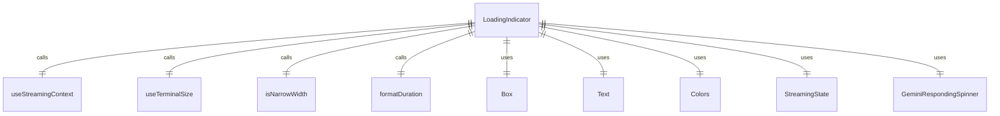
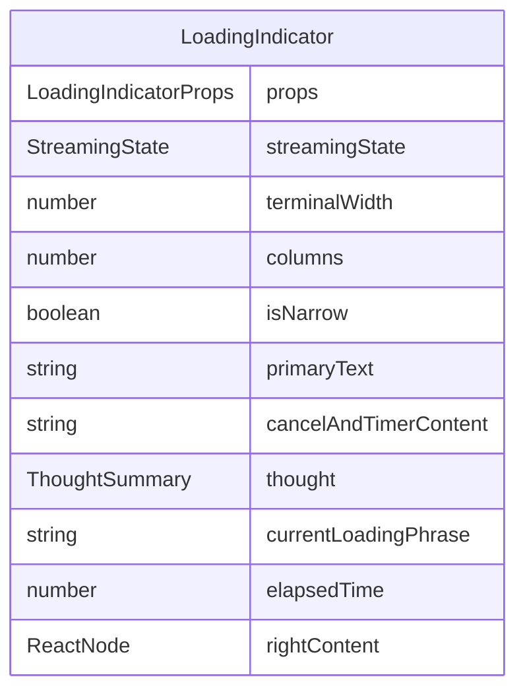

# LoadingIndicator.tsx

加载指示器组件，用于在应用程序处理请求时显示加载状态和进度信息。

## 功能概述

1. 显示加载状态指示器
2. 显示当前加载阶段的描述
3. 显示经过的时间
4. 支持窄屏幕布局适配
5. 显示思维摘要信息

## 组件结构

### LoadingIndicator
- 使用 React hooks 获取上下文和终端信息
- 根据流状态决定是否渲染
- 支持窄屏幕和宽屏幕布局
- 显示 Gemini 响应旋转动画
- 显示取消和计时信息

## 接口定义

### LoadingIndicatorProps
- `currentLoadingPhrase`: 当前加载阶段描述（可选）
- `elapsedTime`: 经过的时间（秒）
- `rightContent`: 右侧内容（可选）
- `thought`: 思维摘要信息（可选）

## 状态管理

- 使用 `useStreamingContext` 获取流状态
- 使用 `useTerminalSize` 获取终端尺寸
- 使用 `isNarrowWidth` 判断是否为窄屏幕

## 条件渲染

- 当流状态为 `StreamingState.Idle` 时不渲染组件
- 根据流状态显示不同的旋转动画
- 根据屏幕宽度调整布局（窄屏幕使用列布局，宽屏幕使用行布局）

## 依赖关系

- 依赖 `react` 和 `ink` 组件
- 依赖 `@google/gemini-cli-core` 的 `ThoughtSummary` 类型
- 依赖 `../colors.js` 的颜色定义
- 依赖 `../contexts/StreamingContext.js` 的流上下文
- 依赖 `../types.js` 的 `StreamingState` 枚举
- 依赖 `./GeminiRespondingSpinner.js` 的旋转动画组件
- 依赖 `../utils/formatters.js` 的时间格式化函数
- 依赖 `../hooks/useTerminalSize.js` 的终端尺寸 hook
- 依赖 `../utils/isNarrowWidth.js` 的窄屏幕判断函数

## 函数级调用关系

## 变量级调用关系

