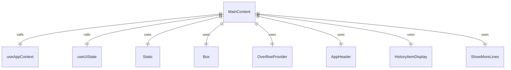
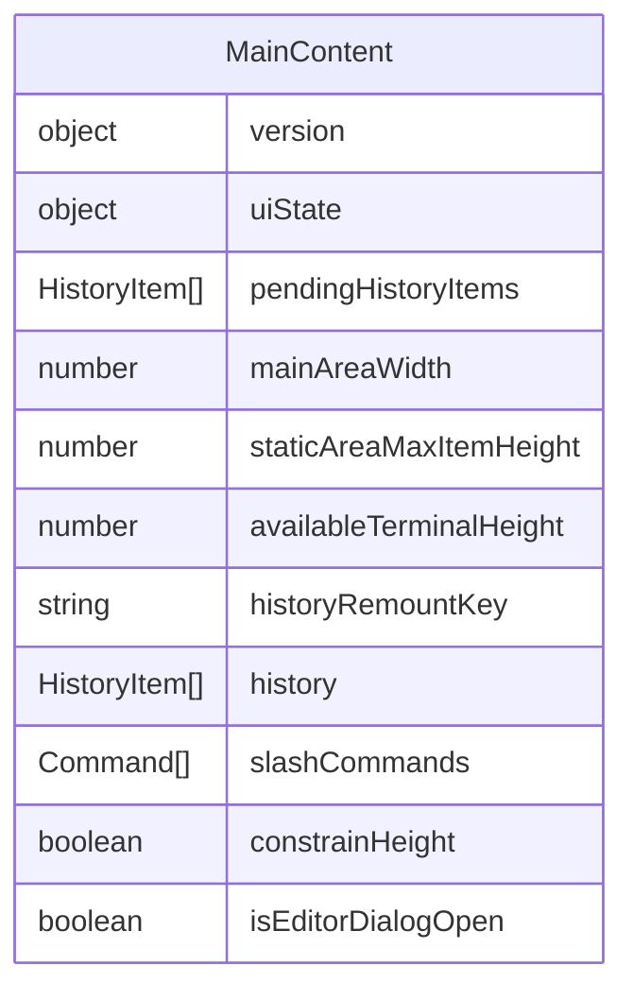

# MainContent.tsx

主内容显示组件，负责渲染应用程序的主要内容区域，包括历史记录项和待处理项。

## 功能概述

1. 渲染应用程序的主要内容区域
2. 显示历史记录项
3. 显示待处理的历史记录项
4. 管理内容区域的布局和溢出处理

## 组件结构

### MainContent
- 使用 React hooks 获取应用状态
- 渲染静态历史记录项
- 渲染待处理的历史记录项
- 使用 OverflowProvider 管理内容溢出
- 包含 AppHeader、HistoryItemDisplay 和 ShowMoreLines 组件

## 状态管理

- 使用 `useAppContext` 获取应用上下文（版本信息）
- 使用 `useUIState` 获取 UI 状态
- 解构 UI 状态中的关键属性：
  - pendingHistoryItems: 待处理的历史记录项
  - mainAreaWidth: 主区域宽度
  - staticAreaMaxItemHeight: 静态区域最大项高度
  - availableTerminalHeight: 可用终端高度

## 组件依赖

- `Static`: Ink 组件，用于渲染静态内容
- `Box`: Ink 组件，用于布局
- `HistoryItemDisplay`: 显示历史记录项
- `ShowMoreLines`: 显示更多行指示器
- `OverflowProvider`: 溢出上下文提供者
- `useUIState`: UI 状态上下文 hook
- `useAppContext`: 应用上下文 hook
- `AppHeader`: 应用头部组件

## 渲染逻辑

1. 使用 `Static` 组件渲染静态内容，包括：
   - AppHeader 组件
   - 所有历史记录项（通过 HistoryItemDisplay 渲染）

2. 使用 `OverflowProvider` 包装待处理内容，包括：
   - 所有待处理的历史记录项
   - ShowMoreLines 组件

## 函数级调用关系

## 变量级调用关系

