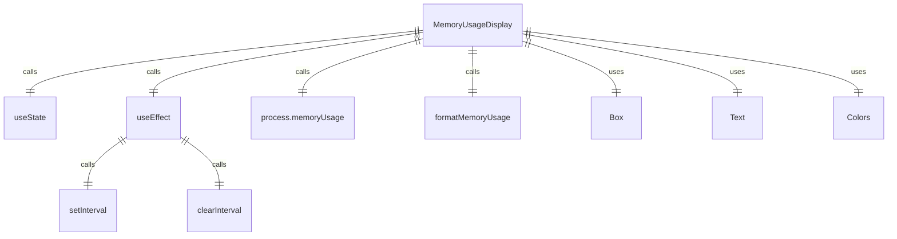

# MemoryUsageDisplay.tsx

内存使用量显示组件，用于实时显示应用程序的内存使用情况。

## 功能概述

1. 实时显示应用程序内存使用量
2. 根据内存使用量改变显示颜色
3. 每2秒更新一次内存使用信息

## 组件结构

### MemoryUsageDisplay
- 使用 React hooks 管理状态和副作用
- 定期获取并格式化内存使用信息
- 根据内存使用量设置显示颜色
- 显示格式化的内存使用量

## 状态管理

- 使用 `useState` 管理内存使用量文本和颜色
- 使用 `useEffect` 设置定时器定期更新内存信息
- 在组件卸载时清理定时器

## 内存监控逻辑

- 使用 `process.memoryUsage().rss` 获取内存使用量
- 使用 `formatMemoryUsage` 格式化内存使用量显示
- 当内存使用量超过2GB时，显示为红色警告色

## 依赖关系

- 依赖 `react` 的 `useEffect` 和 `useState`
- 依赖 `ink` 的 `Box` 和 `Text` 组件
- 依赖 `../colors.js` 的颜色定义
- 依赖 `node:process` 获取内存使用信息
- 依赖 `../utils/formatters.js` 的内存格式化函数

## 函数级调用关系



## 变量级调用关系

```mermaid
erDiagram
    MemoryUsageDisplay {
        string memoryUsage
        string memoryUsageColor
        function updateMemory
        NodeJS.Timeout intervalId
        number usage
    }
```