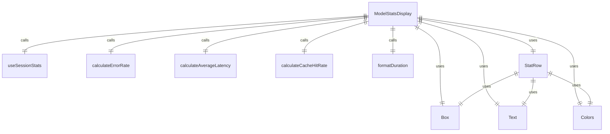
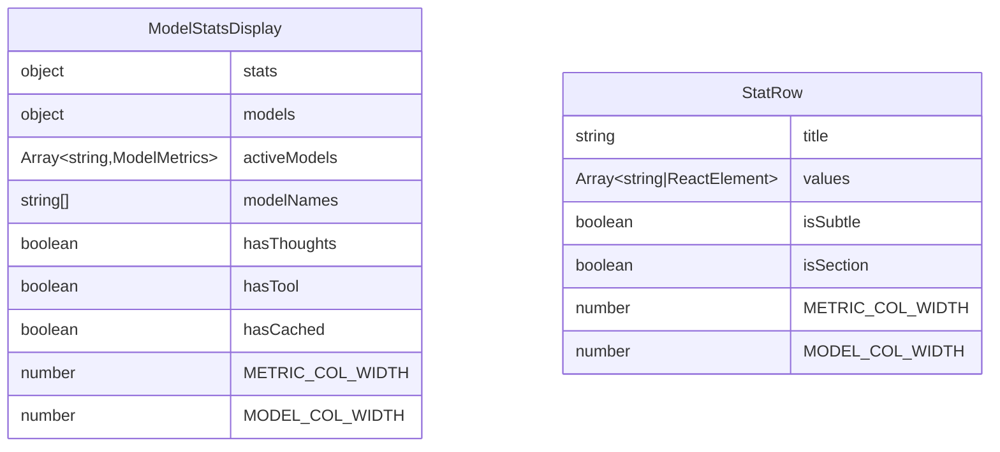

# ModelStatsDisplay.tsx

模型统计数据显示组件，用于显示会话中各个模型的API调用和令牌使用统计信息。

## 功能概述

1. 显示模型API调用统计
2. 显示模型令牌使用统计
3. 计算并显示错误率、平均延迟和缓存命中率
4. 根据数据存在情况动态显示相关统计项

## 组件结构

### ModelStatsDisplay
- 使用 React hooks 获取会话统计信息
- 过滤出有API调用的活跃模型
- 根据模型数量和数据存在情况动态渲染统计表格
- 包含StatRow子组件用于渲染统计行

### StatRow
- 子组件，用于渲染统计表格中的行
- 支持标题、值数组、微妙样式和章节样式
- 使用固定宽度的Box组件对齐内容

## 状态管理

- 使用 `useSessionStats` 获取会话统计信息
- 从统计信息中提取模型指标
- 过滤出有API调用的活跃模型
- 计算模型名称数组用于表头显示

## 动态显示逻辑

- 当没有活跃模型时显示提示信息
- 根据是否存在思维令牌、工具令牌和缓存令牌动态显示相关行
- 根据错误数量设置错误率显示颜色
- 根据缓存令牌数量计算并显示缓存命中率

## 依赖关系

- 依赖 `react` 和 `ink` 组件
- 依赖 `../colors.js` 的颜色定义
- 依赖 `../utils/formatters.js` 的时间格式化函数
- 依赖 `../utils/computeStats.js` 的统计计算函数
- 依赖 `../contexts/SessionContext.js` 的会话上下文和类型

## 函数级调用关系

## 变量级调用关系

